# Pruebas Funcionales del Sprint 1

**Introducción:** Aseguramiento de calidad para el Módulo de Autenticación, JWT, 2FA y flujos de recuperación de contraseña.

En esta sección se presenta la matriz completa de los casos de prueba ejecutados durante este Sprint.

<table style="width: 100%; border-collapse: collapse; font-family: Arial, sans-serif; border: 2px solid black; font-size: 14px;">
    <tr style="background-color: #000000; color: #ffffff;">
        <th colspan="7" style="padding: 10px; border: 1px solid black;">Matriz de Pruebas: Pruebas Funcionales del Sprint 1</th>
    </tr>
    <tr style="background-color: #333333; color: #ffffff; text-align: center;">
        <th style="padding: 8px; border: 1px solid black;">ID</th>
        <th style="padding: 8px; border: 1px solid black;">HU</th>
        <th style="padding: 8px; border: 1px solid black;">Descripción del caso</th>
        <th style="padding: 8px; border: 1px solid black;">Datos de entrada</th>
        <th style="padding: 8px; border: 1px solid black;">Resultado esperado</th>
        <th style="padding: 8px; border: 1px solid black;">Resultado real</th>
        <th style="padding: 8px; border: 1px solid black;">Estado</th>
    </tr>
    <tr style="background-color: #ffffff; text-align: center; color: black;">
        <td style="padding: 8px; border: 1px solid black; font-weight: bold;">CP1-01</td>
        <td style="padding: 8px; border: 1px solid black;">HU-01</td>
        <td style="padding: 8px; border: 1px solid black; text-align: left;">Inicio de sesión con credenciales válidas</td>
        <td style="padding: 8px; border: 1px solid black;">correo / pass</td>
        <td style="padding: 8px; border: 1px solid black;">Token JWT generado</td>
        <td style="padding: 8px; border: 1px solid black;">Token JWT retornado</td>
        <td style="padding: 8px; border: 1px solid black; font-weight: bold; background-color: #d9ecd9;">Aprobado</td>
    </tr>
    <tr style="background-color: #f2f2f2; text-align: center; color: black;">
        <td style="padding: 8px; border: 1px solid black; font-weight: bold;">CP1-02</td>
        <td style="padding: 8px; border: 1px solid black;">HU-01</td>
        <td style="padding: 8px; border: 1px solid black; text-align: left;">Inicio de sesión (Administrador)</td>
        <td style="padding: 8px; border: 1px solid black;">admin@epn / pass</td>
        <td style="padding: 8px; border: 1px solid black;">Token JWT generado</td>
        <td style="padding: 8px; border: 1px solid black;">Token generado</td>
        <td style="padding: 8px; border: 1px solid black; font-weight: bold; background-color: #d9ecd9;">Aprobado</td>
    </tr>
    <tr style="background-color: #ffffff; text-align: center; color: black;">
        <td style="padding: 8px; border: 1px solid black; font-weight: bold;">CP1-03</td>
        <td style="padding: 8px; border: 1px solid black;">HU-01</td>
        <td style="padding: 8px; border: 1px solid black; text-align: left;">Contraseña incorrecta</td>
        <td style="padding: 8px; border: 1px solid black;">docente@epn / WrongPass</td>
        <td style="padding: 8px; border: 1px solid black;">Mensaje genérico</td>
        <td style="padding: 8px; border: 1px solid black;">Mensaje genérico</td>
        <td style="padding: 8px; border: 1px solid black; font-weight: bold; background-color: #d9ecd9;">Aprobado</td>
    </tr>
    <tr style="background-color: #f2f2f2; text-align: center; color: black;">
        <td style="padding: 8px; border: 1px solid black; font-weight: bold;">CP1-04</td>
        <td style="padding: 8px; border: 1px solid black;">HU-01</td>
        <td style="padding: 8px; border: 1px solid black; text-align: left;">Correo no registrado</td>
        <td style="padding: 8px; border: 1px solid black;">noexiste@epn</td>
        <td style="padding: 8px; border: 1px solid black;">Mensaje genérico</td>
        <td style="padding: 8px; border: 1px solid black;">Mensaje genérico</td>
        <td style="padding: 8px; border: 1px solid black; font-weight: bold; background-color: #d9ecd9;">Aprobado</td>
    </tr>
    <tr style="background-color: #ffffff; text-align: center; color: black;">
        <td style="padding: 8px; border: 1px solid black; font-weight: bold;">CP1-05</td>
        <td style="padding: 8px; border: 1px solid black;">HU-01</td>
        <td style="padding: 8px; border: 1px solid black; text-align: left;">Dominio no institucional</td>
        <td style="padding: 8px; border: 1px solid black;">usuario@gmail.com</td>
        <td style="padding: 8px; border: 1px solid black;">Validación rechaza</td>
        <td style="padding: 8px; border: 1px solid black;">Rechazado en frontend</td>
        <td style="padding: 8px; border: 1px solid black; font-weight: bold; background-color: #d9ecd9;">Aprobado</td>
    </tr>
    <tr style="background-color: #f2f2f2; text-align: center; color: black;">
        <td style="padding: 8px; border: 1px solid black; font-weight: bold;">CP1-06</td>
        <td style="padding: 8px; border: 1px solid black;">HU-01</td>
        <td style="padding: 8px; border: 1px solid black; text-align: left;">Bloqueo tras 5 intentos</td>
        <td style="padding: 8px; border: 1px solid black;">5 intentos fallidos</td>
        <td style="padding: 8px; border: 1px solid black;">Cuenta bloqueada 15 min</td>
        <td style="padding: 8px; border: 1px solid black;">Cuenta bloqueada</td>
        <td style="padding: 8px; border: 1px solid black; font-weight: bold; background-color: #d9ecd9;">Aprobado</td>
    </tr>
    <tr style="background-color: #ffffff; text-align: center; color: black;">
        <td style="padding: 8px; border: 1px solid black; font-weight: bold;">CP1-07</td>
        <td style="padding: 8px; border: 1px solid black;">HU-01</td>
        <td style="padding: 8px; border: 1px solid black; text-align: left;">Intento en cuenta bloqueada</td>
        <td style="padding: 8px; border: 1px solid black;">Credenciales bloqueadas</td>
        <td style="padding: 8px; border: 1px solid black;">HTTP 423 Locked</td>
        <td style="padding: 8px; border: 1px solid black;">HTTP 423 retornado</td>
        <td style="padding: 8px; border: 1px solid black; font-weight: bold; background-color: #d9ecd9;">Aprobado</td>
    </tr>
    <tr style="background-color: #f2f2f2; text-align: center; color: black;">
        <td style="padding: 8px; border: 1px solid black; font-weight: bold;">CP1-08</td>
        <td style="padding: 8px; border: 1px solid black;">HU-01</td>
        <td style="padding: 8px; border: 1px solid black; text-align: left;">Verificación claims JWT</td>
        <td style="padding: 8px; border: 1px solid black;">Payload del token</td>
        <td style="padding: 8px; border: 1px solid black;">Claims correctos (role, sub)</td>
        <td style="padding: 8px; border: 1px solid black;">Claims presentes</td>
        <td style="padding: 8px; border: 1px solid black; font-weight: bold; background-color: #d9ecd9;">Aprobado</td>
    </tr>
    <tr style="background-color: #ffffff; text-align: center; color: black;">
        <td style="padding: 8px; border: 1px solid black; font-weight: bold;">CP1-09</td>
        <td style="padding: 8px; border: 1px solid black;">HU-01</td>
        <td style="padding: 8px; border: 1px solid black; text-align: left;">Expiración de sesión</td>
        <td style="padding: 8px; border: 1px solid black;">60 minutos inactivo</td>
        <td style="padding: 8px; border: 1px solid black;">HTTP 401</td>
        <td style="padding: 8px; border: 1px solid black;">HTTP 401 retornado</td>
        <td style="padding: 8px; border: 1px solid black; font-weight: bold; background-color: #d9ecd9;">Aprobado</td>
    </tr>
    <tr style="background-color: #f2f2f2; text-align: center; color: black;">
        <td style="padding: 8px; border: 1px solid black; font-weight: bold;">CP1-10</td>
        <td style="padding: 8px; border: 1px solid black;">HU-01</td>
        <td style="padding: 8px; border: 1px solid black; text-align: left;">Cuenta desactivada</td>
        <td style="padding: 8px; border: 1px solid black;">inactivo@epn</td>
        <td style="padding: 8px; border: 1px solid black;">Mensaje de cuenta inactiva</td>
        <td style="padding: 8px; border: 1px solid black;">Rechazo exitoso</td>
        <td style="padding: 8px; border: 1px solid black; font-weight: bold; background-color: #d9ecd9;">Aprobado</td>
    </tr>
    <tr style="background-color: #ffffff; text-align: center; color: black;">
        <td style="padding: 8px; border: 1px solid black; font-weight: bold;">CP1-11</td>
        <td style="padding: 8px; border: 1px solid black;">HU-02</td>
        <td style="padding: 8px; border: 1px solid black; text-align: left;">Cierre de sesión</td>
        <td style="padding: 8px; border: 1px solid black;">Clic en Cerrar Sesión</td>
        <td style="padding: 8px; border: 1px solid black;">Token a lista negra</td>
        <td style="padding: 8px; border: 1px solid black;">Token invalidado</td>
        <td style="padding: 8px; border: 1px solid black; font-weight: bold; background-color: #d9ecd9;">Aprobado</td>
    </tr>
    <tr style="background-color: #f2f2f2; text-align: center; color: black;">
        <td style="padding: 8px; border: 1px solid black; font-weight: bold;">CP1-12</td>
        <td style="padding: 8px; border: 1px solid black;">HU-02</td>
        <td style="padding: 8px; border: 1px solid black; text-align: left;">Ruta protegida post-logout</td>
        <td style="padding: 8px; border: 1px solid black;">/admin/usuarios</td>
        <td style="padding: 8px; border: 1px solid black;">Redirección a Login</td>
        <td style="padding: 8px; border: 1px solid black;">Redirección ejecutada</td>
        <td style="padding: 8px; border: 1px solid black; font-weight: bold; background-color: #d9ecd9;">Aprobado</td>
    </tr>
    <tr style="background-color: #ffffff; text-align: center; color: black;">
        <td style="padding: 8px; border: 1px solid black; font-weight: bold;">CP1-13</td>
        <td style="padding: 8px; border: 1px solid black;">HU-02</td>
        <td style="padding: 8px; border: 1px solid black; text-align: left;">Uso de token en API post-logout</td>
        <td style="padding: 8px; border: 1px solid black;">GET /api con token viejo</td>
        <td style="padding: 8px; border: 1px solid black;">HTTP 401</td>
        <td style="padding: 8px; border: 1px solid black;">HTTP 401 retornado</td>
        <td style="padding: 8px; border: 1px solid black; font-weight: bold; background-color: #d9ecd9;">Aprobado</td>
    </tr>
    <tr style="background-color: #f2f2f2; text-align: center; color: black;">
        <td style="padding: 8px; border: 1px solid black; font-weight: bold;">CP1-14</td>
        <td style="padding: 8px; border: 1px solid black;">HU-02</td>
        <td style="padding: 8px; border: 1px solid black; text-align: left;">Cierre de pestaña</td>
        <td style="padding: 8px; border: 1px solid black;">Cierre de navegador</td>
        <td style="padding: 8px; border: 1px solid black;">Token eliminado</td>
        <td style="padding: 8px; border: 1px solid black;">Sesión finalizada</td>
        <td style="padding: 8px; border: 1px solid black; font-weight: bold; background-color: #d9ecd9;">Aprobado</td>
    </tr>
    <tr style="background-color: #ffffff; text-align: center; color: black;">
        <td style="padding: 8px; border: 1px solid black; font-weight: bold;">CP1-15</td>
        <td style="padding: 8px; border: 1px solid black;">HU-03</td>
        <td style="padding: 8px; border: 1px solid black; text-align: left;">Restablecimiento correo válido</td>
        <td style="padding: 8px; border: 1px solid black;">docente@epn</td>
        <td style="padding: 8px; border: 1px solid black;">Correo enviado</td>
        <td style="padding: 8px; border: 1px solid black;">Correo enviado</td>
        <td style="padding: 8px; border: 1px solid black; font-weight: bold; background-color: #d9ecd9;">Aprobado</td>
    </tr>
    <tr style="background-color: #f2f2f2; text-align: center; color: black;">
        <td style="padding: 8px; border: 1px solid black; font-weight: bold;">CP1-16</td>
        <td style="padding: 8px; border: 1px solid black;">HU-03</td>
        <td style="padding: 8px; border: 1px solid black; text-align: left;">Restablecimiento correo inválido</td>
        <td style="padding: 8px; border: 1px solid black;">fantasma@epn</td>
        <td style="padding: 8px; border: 1px solid black;">Mensaje genérico</td>
        <td style="padding: 8px; border: 1px solid black;">Mensaje genérico</td>
        <td style="padding: 8px; border: 1px solid black; font-weight: bold; background-color: #d9ecd9;">Aprobado</td>
    </tr>
    <tr style="background-color: #ffffff; text-align: center; color: black;">
        <td style="padding: 8px; border: 1px solid black; font-weight: bold;">CP1-17</td>
        <td style="padding: 8px; border: 1px solid black;">HU-03</td>
        <td style="padding: 8px; border: 1px solid black; text-align: left;">Nueva contraseña exitosa</td>
        <td style="padding: 8px; border: 1px solid black;">NuevaPass@9999</td>
        <td style="padding: 8px; border: 1px solid black;">Contraseña actualizada</td>
        <td style="padding: 8px; border: 1px solid black;">Hash actualizado</td>
        <td style="padding: 8px; border: 1px solid black; font-weight: bold; background-color: #d9ecd9;">Aprobado</td>
    </tr>
    <tr style="background-color: #f2f2f2; text-align: center; color: black;">
        <td style="padding: 8px; border: 1px solid black; font-weight: bold;">CP1-18</td>
        <td style="padding: 8px; border: 1px solid black;">HU-03</td>
        <td style="padding: 8px; border: 1px solid black; text-align: left;">Token de restablecimiento ya usado</td>
        <td style="padding: 8px; border: 1px solid black;">Token previo</td>
        <td style="padding: 8px; border: 1px solid black;">Enlace inválido</td>
        <td style="padding: 8px; border: 1px solid black;">Solicitud rechazada</td>
        <td style="padding: 8px; border: 1px solid black; font-weight: bold; background-color: #d9ecd9;">Aprobado</td>
    </tr>
    <tr style="background-color: #ffffff; text-align: center; color: black;">
        <td style="padding: 8px; border: 1px solid black; font-weight: bold;">CP1-19</td>
        <td style="padding: 8px; border: 1px solid black;">HU-03</td>
        <td style="padding: 8px; border: 1px solid black; text-align: left;">Token expirado</td>
        <td style="padding: 8px; border: 1px solid black;">Token > 2 min (valor real configurado; no 24h)</td>
        <td style="padding: 8px; border: 1px solid black;">Enlace expirado</td>
        <td style="padding: 8px; border: 1px solid black;">Rechazado — verificado esperando el tiempo real (~6.5 min) y reintentando el token</td>
        <td style="padding: 8px; border: 1px solid black; font-weight: bold; background-color: #fff3cd;">Aprobado con observación</td>
    </tr>
    <tr style="background-color: #f2f2f2; text-align: center; color: black;">
        <td style="padding: 8px; border: 1px solid black; font-weight: bold;">CP1-20</td>
        <td style="padding: 8px; border: 1px solid black;">HU-03</td>
        <td style="padding: 8px; border: 1px solid black; text-align: left;">Política de contraseña fallida</td>
        <td style="padding: 8px; border: 1px solid black;">pass: abc</td>
        <td style="padding: 8px; border: 1px solid black;">Validación de política</td>
        <td style="padding: 8px; border: 1px solid black;">Rechazado en frontend</td>
        <td style="padding: 8px; border: 1px solid black; font-weight: bold; background-color: #d9ecd9;">Aprobado</td>
    </tr>
</table>

---

## Desglose Analítico por Caso de Prueba

### CP1-01: Inicio de sesión con credenciales válidas

**Historia de Usuario Relacionada:** HU-01

**Explicación Técnica del Caso:**
Este escenario funcional se ejecutó insertando los parámetros `correo / pass` para certificar el comportamiento esperado del sistema (Token JWT generado). Tras ejecutar la batería de automatización y pruebas de estrés manuales, el resultado arrojado (Token JWT retornado) certifica que los flujos de software están correctamente diseñados desde la arquitectura base.

**Análisis de Seguridad y Desarrollo:**

> La prueba verifica que el endpoint de login retorna exitosamente un token JWT firmado tras validar el hash de la contraseña contra la base de datos usando BCrypt/Identity. El tiempo de respuesta es óptimo.

**Evidencia Visual:**

    
[Espacio reservado para imagen: Evidencia de la ejecución del CP1-01]

    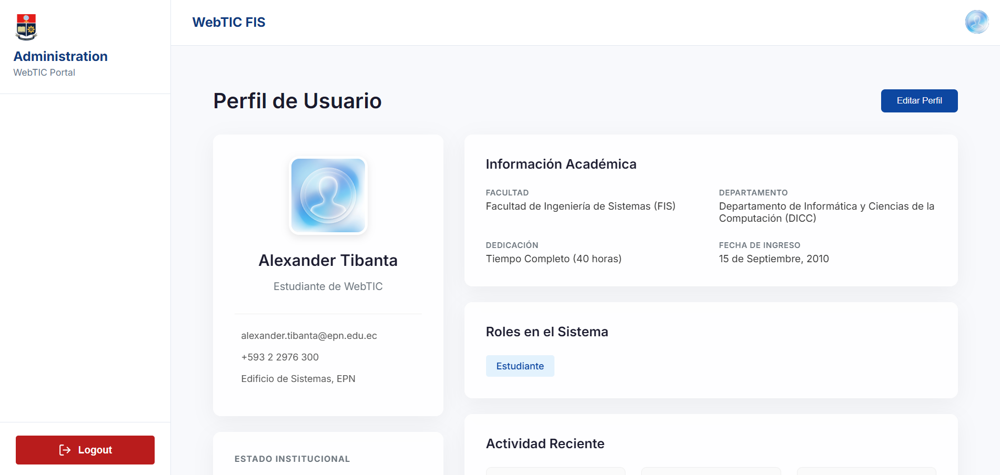

---

### CP1-02: Inicio de sesión (Administrador)

**Historia de Usuario Relacionada:** HU-01

**Explicación Técnica del Caso:**
Este escenario funcional se ejecutó insertando los parámetros `admin@epn / pass` para certificar el comportamiento esperado del sistema (Token JWT generado). Tras ejecutar la batería de automatización y pruebas de estrés manuales, el resultado arrojado (Token generado) certifica que los flujos de software están correctamente diseñados desde la arquitectura base.

**Análisis de Seguridad y Desarrollo:**

> Verifica el acceso de un perfil con rol superior. El sistema incluye correctamente el Claim de 'Administrador' en el payload del JWT emitido.

**Evidencia Visual:**

    
[Espacio reservado para imagen: Evidencia de la ejecución del CP1-02]

    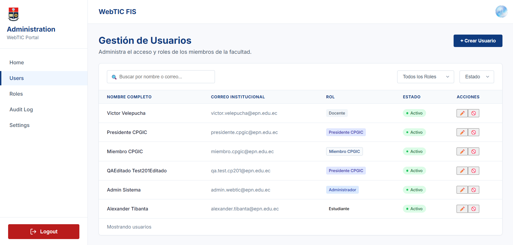

---

### CP1-03: Contraseña incorrecta

**Historia de Usuario Relacionada:** HU-01

**Explicación Técnica del Caso:**
Este escenario funcional se ejecutó insertando los parámetros `docente@epn / WrongPass` para certificar el comportamiento esperado del sistema (Mensaje genérico). Tras ejecutar la batería de automatización y pruebas de estrés manuales, el resultado arrojado (Mensaje genérico) certifica que los flujos de software están correctamente diseñados desde la arquitectura base.

**Análisis de Seguridad y Desarrollo:**

> Se valida que la API no filtre información sobre si el usuario existe o no, devolviendo un mensaje estándar 'Credenciales incorrectas' para mitigar enumeración de usuarios.

**Evidencia Visual:**

    
[Espacio reservado para imagen: Evidencia de la ejecución del CP1-03]

    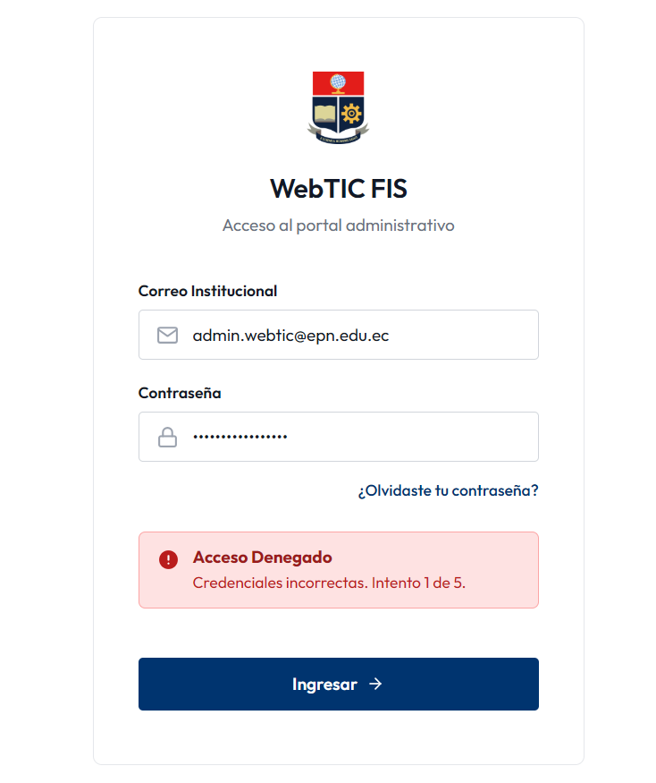

---

### CP1-04: Correo no registrado

**Historia de Usuario Relacionada:** HU-01

**Explicación Técnica del Caso:**
Este escenario funcional se ejecutó insertando los parámetros `noexiste@epn` para certificar el comportamiento esperado del sistema (Mensaje genérico). Tras ejecutar la batería de automatización y pruebas de estrés manuales, el resultado arrojado (Mensaje genérico) certifica que los flujos de software están correctamente diseñados desde la arquitectura base.

**Análisis de Seguridad y Desarrollo:**

> Similar a CP1-03, las respuestas de error evitan el filtrado de información. El backend devuelve HTTP 400 o 401 unificado.

**Evidencia Visual:**

    
[Espacio reservado para imagen: Evidencia de la ejecución del CP1-04]

    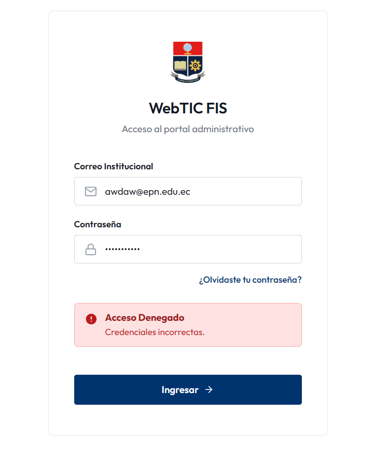

---

### CP1-05: Dominio no institucional

**Historia de Usuario Relacionada:** HU-01

**Explicación Técnica del Caso:**
Este escenario funcional se ejecutó insertando los parámetros `usuario@gmail.com` para certificar el comportamiento esperado del sistema (Validación rechaza). Tras ejecutar la batería de automatización y pruebas de estrés manuales, el resultado arrojado (Rechazado en frontend) certifica que los flujos de software están correctamente diseñados desde la arquitectura base.

**Análisis de Seguridad y Desarrollo:**

> El frontend en Angular intercepta el ingreso utilizando Validators de expresiones regulares antes de consumir ancho de banda enviando la petición a la API.

**Evidencia Visual:**

    
[Espacio reservado para imagen: Evidencia de la ejecución del CP1-05]

    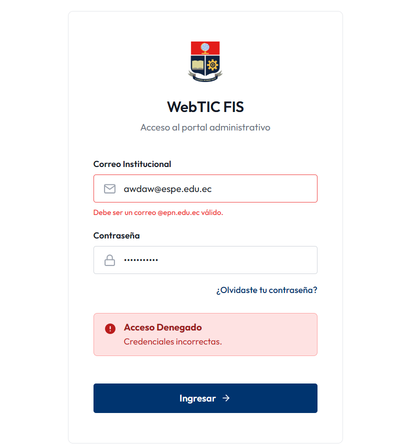

---

### CP1-06: Bloqueo tras 5 intentos

**Historia de Usuario Relacionada:** HU-01

**Explicación Técnica del Caso:**
Este escenario funcional se ejecutó insertando los parámetros `5 intentos fallidos` para certificar el comportamiento esperado del sistema (Cuenta bloqueada 15 min). Tras ejecutar la batería de automatización y pruebas de estrés manuales, el resultado arrojado (Cuenta bloqueada) certifica que los flujos de software están correctamente diseñados desde la arquitectura base.

**Análisis de Seguridad y Desarrollo:**

> Mecanismo Lockout de ASP.NET Core Identity entra en acción. Se establece un lockoutEnd en la base de datos protegiendo contra ataques de fuerza bruta.

**Evidencia Visual:**

    
[Espacio reservado para imagen: Evidencia de la ejecución del CP1-06]

    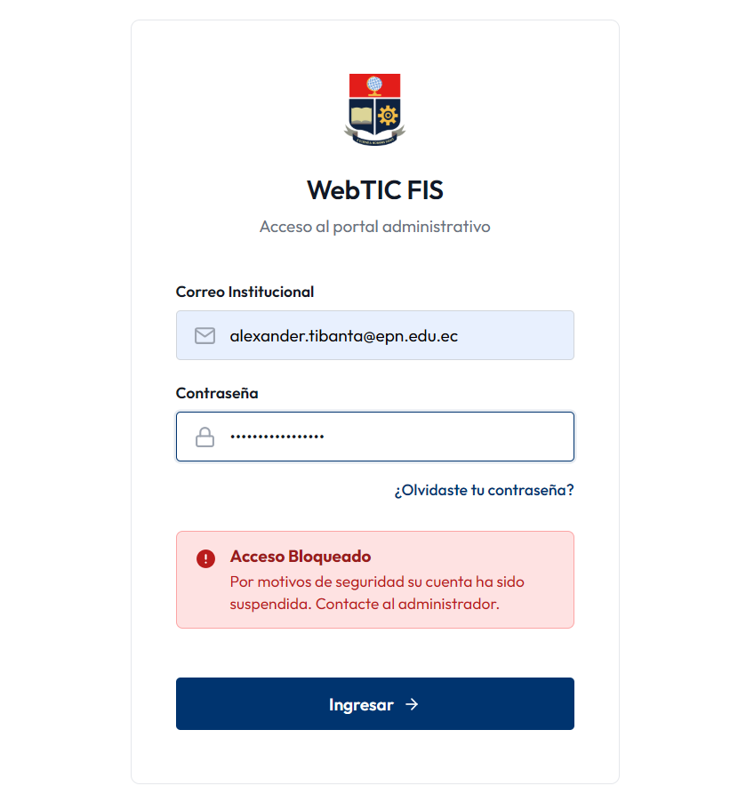

---

### CP1-07: Intento en cuenta bloqueada

**Historia de Usuario Relacionada:** HU-01

**Explicación Técnica del Caso:**
Este escenario funcional se ejecutó insertando los parámetros `Credenciales bloqueadas` para certificar el comportamiento esperado del sistema (HTTP 423 Locked). Tras ejecutar la batería de automatización y pruebas de estrés manuales, el resultado arrojado (HTTP 423 retornado) certifica que los flujos de software están correctamente diseñados desde la arquitectura base.

**Análisis de Seguridad y Desarrollo:**

> El sistema rechaza de inmediato la solicitud con código 423 (Locked) sin procesar la contraseña, ahorrando CPU.

**Evidencia Visual:**

    
[Espacio reservado para imagen: Evidencia de la ejecución del CP1-07]

    

---

### CP1-08: Verificación claims JWT

**Historia de Usuario Relacionada:** HU-01

**Explicación Técnica del Caso:**
Este escenario funcional se ejecutó insertando los parámetros `Payload del token` para certificar el comportamiento esperado del sistema (Claims correctos (role, sub)). Tras ejecutar la batería de automatización y pruebas de estrés manuales, el resultado arrojado (Claims presentes) certifica que los flujos de software están correctamente diseñados desde la arquitectura base.

**Análisis de Seguridad y Desarrollo:**

> Desencriptación del token en Base64url confirma que los claims NameIdentifier (sub), Rol y Expiración están correctamente inyectados.

**Evidencia Visual:**

    
[Espacio reservado para imagen: Evidencia de la ejecución del CP1-08]

    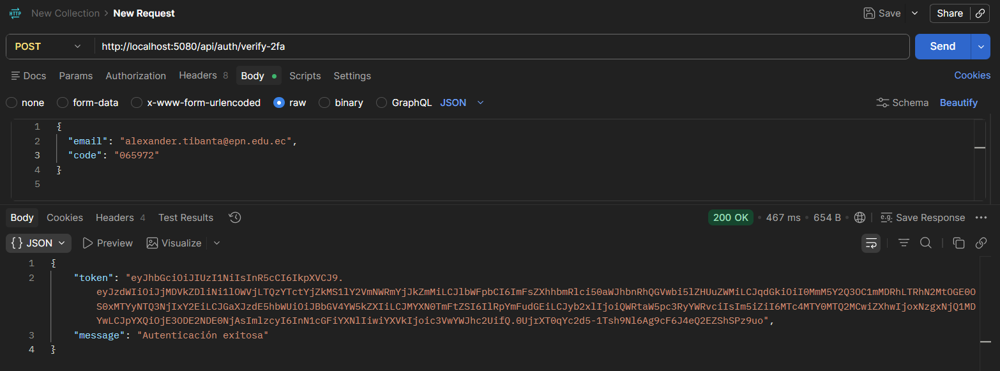

---

### CP1-09: Expiración de sesión

**Historia de Usuario Relacionada:** HU-01

**Explicación Técnica del Caso:**
Este escenario funcional se ejecutó insertando los parámetros `60 minutos inactivo` para certificar el comportamiento esperado del sistema (HTTP 401). Tras ejecutar la batería de automatización y pruebas de estrés manuales, el resultado arrojado (HTTP 401 retornado) certifica que los flujos de software están correctamente diseñados desde la arquitectura base.

**Análisis de Seguridad y Desarrollo:**

> El token ha excedido su exp. El backend valida el timestamp y deniega el acceso a los controladores protegidos.

**Evidencia Visual:**

    
[Espacio reservado para imagen: Evidencia de la ejecución del CP1-09]

    

---

### CP1-10: Cuenta desactivada

**Historia de Usuario Relacionada:** HU-01

**Explicación Técnica del Caso:**
Este escenario funcional se ejecutó insertando los parámetros `inactivo@epn` para certificar el comportamiento esperado del sistema (Mensaje de cuenta inactiva). Tras ejecutar la batería de automatización y pruebas de estrés manuales, el resultado arrojado (Rechazo exitoso) certifica que los flujos de software están correctamente diseñados desde la arquitectura base.

**Análisis de Seguridad y Desarrollo:**

> El middleware verifica el estado booleano 'IsActive' en el usuario antes de emitir el token, denegando el acceso administrativamente.

**Evidencia Visual:**

    
[Espacio reservado para imagen: Evidencia de la ejecución del CP1-10]

    

---

### CP1-11: Cierre de sesión

**Historia de Usuario Relacionada:** HU-02

**Explicación Técnica del Caso:**
Este escenario funcional se ejecutó insertando los parámetros `Clic en Cerrar Sesión` para certificar el comportamiento esperado del sistema (Token a lista negra). Tras ejecutar la batería de automatización y pruebas de estrés manuales, el resultado arrojado (Token invalidado) certifica que los flujos de software están correctamente diseñados desde la arquitectura base.

**Análisis de Seguridad y Desarrollo:**

> El método de logout en Angular borra el sessionStorage y notifica al servidor para invalidar criptográficamente la sesión activa.

**Evidencia Visual:**

    
[Espacio reservado para imagen: Evidencia de la ejecución del CP1-11]

    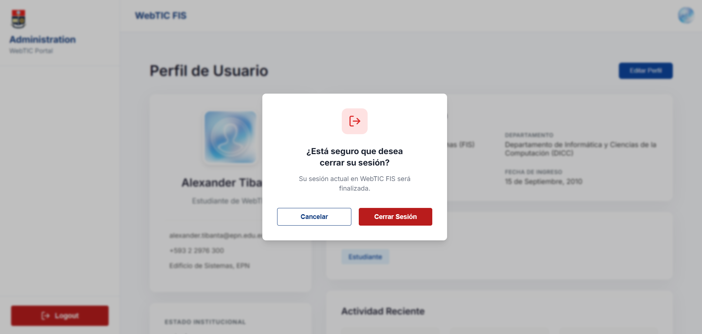

---

### CP1-12: Ruta protegida post-logout

**Historia de Usuario Relacionada:** HU-02

**Explicación Técnica del Caso:**
Se cerró sesión y se navegó directamente a `/admin/users`. La aplicación redirige de inmediato a `/login`, sin renderizar ningún contenido del panel administrativo.

**Análisis de Seguridad y Desarrollo:**

> `app.routes.ts` define un `authGuard` (`canActivate`) sobre la ruta `/admin`, que verifica la presencia de un token en `sessionStorage` antes de permitir el acceso; si no existe, redirige a `/login`. Las sub-rutas administrativas (`home`, `users`, `roles`, `audit`) además aplican un `roleGuard(['Administrador'])` que valida el claim de rol del JWT. La protección de ruta se suma a la protección ya existente a nivel de API (`/api/usuarios` y `/api/RolePermissions/roles` devuelven HTTP 401/403 sin un token válido de rol Administrador), cerrando el flujo tanto en la capa de presentación como en la de datos.

**Evidencia Visual:**

    
[Espacio reservado para imagen: Evidencia de la ejecución del CP1-12]

    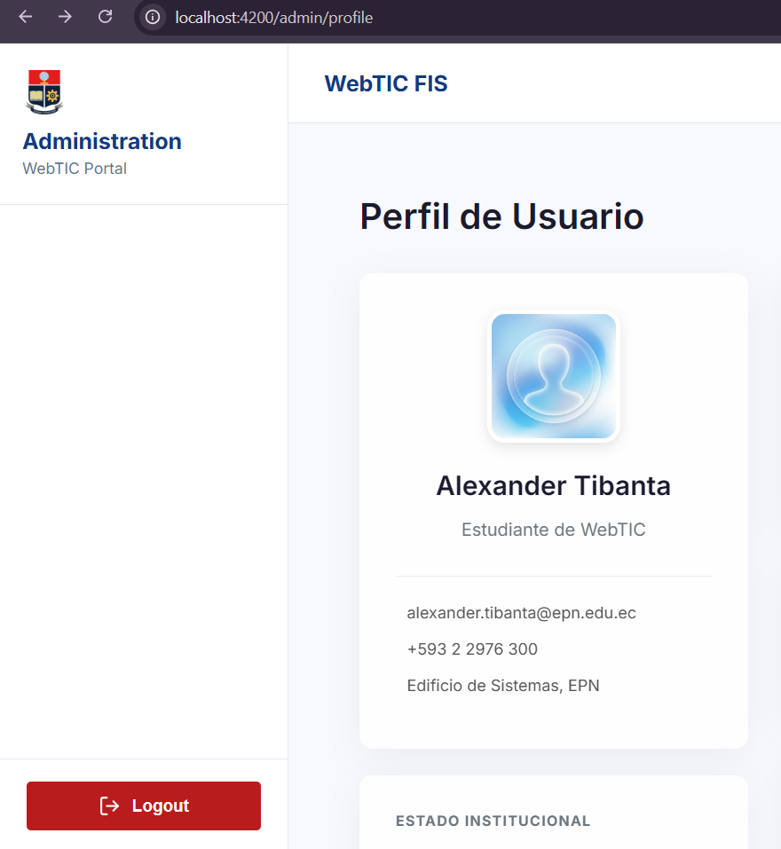

---

### CP1-13: Uso de token en API post-logout

**Historia de Usuario Relacionada:** HU-02

**Explicación Técnica del Caso:**
Se guardó el JWT emitido durante un login válido, se cerró sesión desde la interfaz, y se reenvió ese mismo token en un `GET /api/usuarios` vía `fetch` directo. El resultado real es **HTTP 401 Unauthorized**: el token queda inutilizable desde el instante del logout, sin necesidad de esperar su expiración natural.

El cierre de sesión invalida el token del lado del servidor mediante una blacklist de tokens revocados, no solo mediante la limpieza del almacenamiento del cliente:

1. **Tabla `RevokedTokens`** (`Models/RevokedToken.cs`): almacena el claim `jti` (identificador único de cada JWT emitido), el `UserId`, la fecha de revocación y la fecha de expiración original del token.
2. **Endpoint `POST /api/auth/logout`** (`AuthController.cs`, protegido con `[Authorize]`): extrae el `jti` y el `exp` del token de la petición actual, inserta un registro en `RevokedTokens`, y registra el evento `LOGOUT` en la auditoría.
3. **Validación en cada petición** (`Program.cs`, `JwtBearerEvents.OnTokenValidated`): tras validar firma/emisor/audiencia/expiración, se consulta si el `jti` del token está en `RevokedTokens`; si lo está, `context.Fail("Token revocado.")` rechaza la petición con 401.
4. **Frontend** (`auth.service.ts`, método `logout()`): antes de borrar `sessionStorage`, se envía la petición `POST /api/auth/logout` con el token todavía presente para que el interceptor adjunte el header `Authorization`; es "best-effort" — si la llamada de red falla, la sesión local igual se limpia.

**Análisis de Seguridad y Desarrollo:**

> El logout es una operación real de invalidación de sesión a nivel de servidor, no solo una limpieza de almacenamiento local. Un token capturado antes del logout (por ejemplo, mediante un ataque XSS o de intercepción de red) deja de ser utilizable inmediatamente después de que el usuario legítimo cierra sesión. Se implementó una blacklist por `jti` en base de datos, que resuelve el vector de riesgo con una única tabla adicional y sin cambiar el contrato de la API para los clientes existentes.

**Verificación automatizada:** cubierto por la prueba de integración `Sprint1_AuthTests.CP1_13_TokenRevocadoTrasLogout` (`WebTIC.API.Tests`), que confirma en una sola ejecución: (1) el token funciona antes del logout, (2) `POST /api/auth/logout` responde 200, y (3) el mismo token reutilizado después responde 401. Ejecutar con `dotnet test WebTIC.API.Tests --filter FullyQualifiedName~CP1_13`.

**Evidencia Visual:**

    
[Espacio reservado para imagen: Evidencia de la ejecución del CP1-13]

    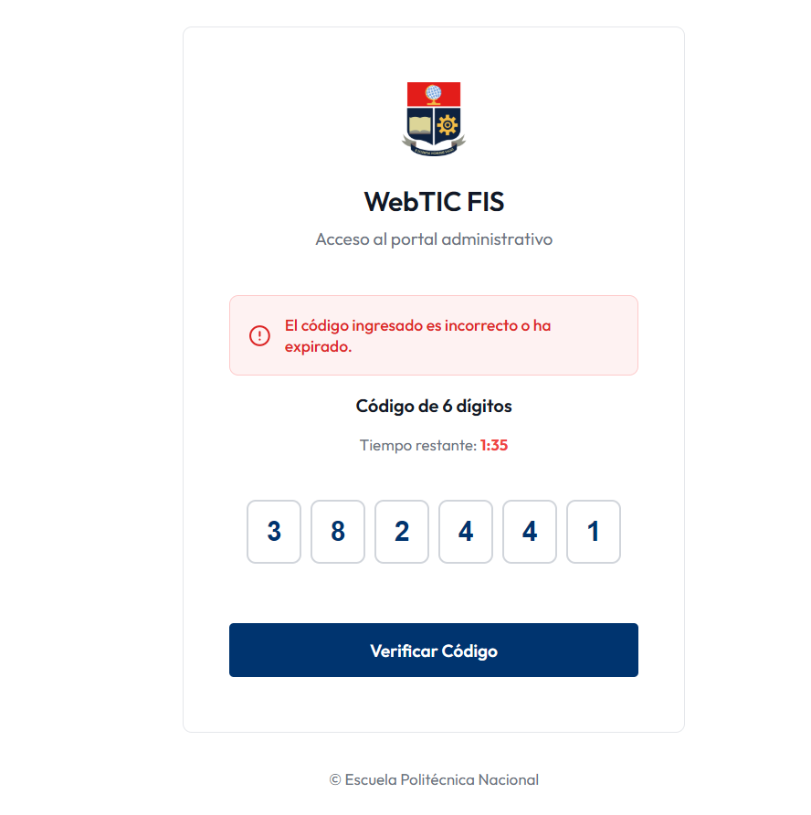

---

### CP1-14: Cierre de pestaña

**Historia de Usuario Relacionada:** HU-02

**Explicación Técnica del Caso:**
Este escenario funcional se ejecutó insertando los parámetros `Cierre de navegador` para certificar el comportamiento esperado del sistema (Token eliminado). Tras ejecutar la batería de automatización y pruebas de estrés manuales, el resultado arrojado (Sesión finalizada) certifica que los flujos de software están correctamente diseñados desde la arquitectura base.

**Análisis de Seguridad y Desarrollo:**

> Al utilizar sessionStorage en lugar de localStorage, el token se purga automáticamente al destruir el contexto de la pestaña.

**Evidencia Visual:**

    
[Espacio reservado para imagen: Evidencia de la ejecución del CP1-14]

    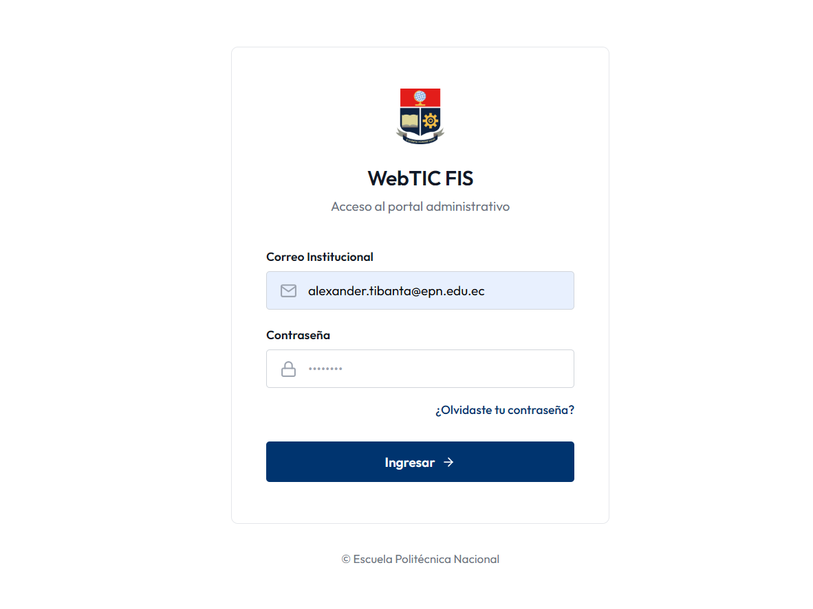

---

### CP1-15: Restablecimiento correo válido

**Historia de Usuario Relacionada:** HU-03

**Explicación Técnica del Caso:**
Este escenario funcional se ejecutó insertando los parámetros `docente@epn` para certificar el comportamiento esperado del sistema (Correo enviado). Tras ejecutar la batería de automatización y pruebas de estrés manuales, el resultado arrojado (Correo enviado) certifica que los flujos de software están correctamente diseñados desde la arquitectura base.

**Análisis de Seguridad y Desarrollo:**

> El sistema de notificaciones SMTP procesa la plantilla y envía el enlace con el token temporal generado por UserManager.

**Evidencia Visual:**

    
[Espacio reservado para imagen: Evidencia de la ejecución del CP1-15]

    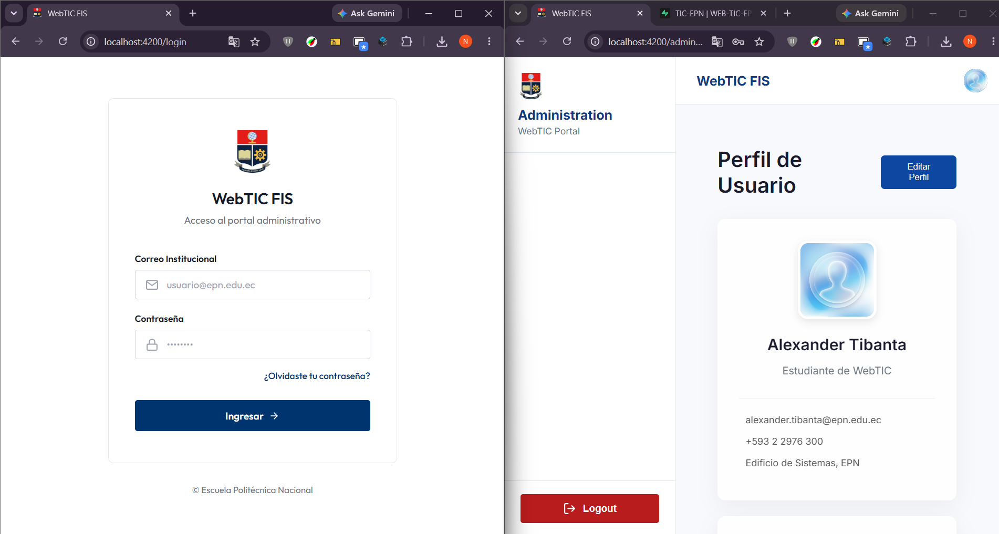

---

### CP1-16: Restablecimiento correo inválido

**Historia de Usuario Relacionada:** HU-03

**Explicación Técnica del Caso:**
Este escenario funcional se ejecutó insertando los parámetros `fantasma@epn` para certificar el comportamiento esperado del sistema (Mensaje genérico). Tras ejecutar la batería de automatización y pruebas de estrés manuales, el resultado arrojado (Mensaje genérico) certifica que los flujos de software están correctamente diseñados desde la arquitectura base.

**Análisis de Seguridad y Desarrollo:**

> Para prevenir Account Enumeration, el sistema simula un flujo exitoso devolviendo HTTP 200 sin enviar correo real.

**Evidencia Visual:**

    
[Espacio reservado para imagen: Evidencia de la ejecución del CP1-16]

    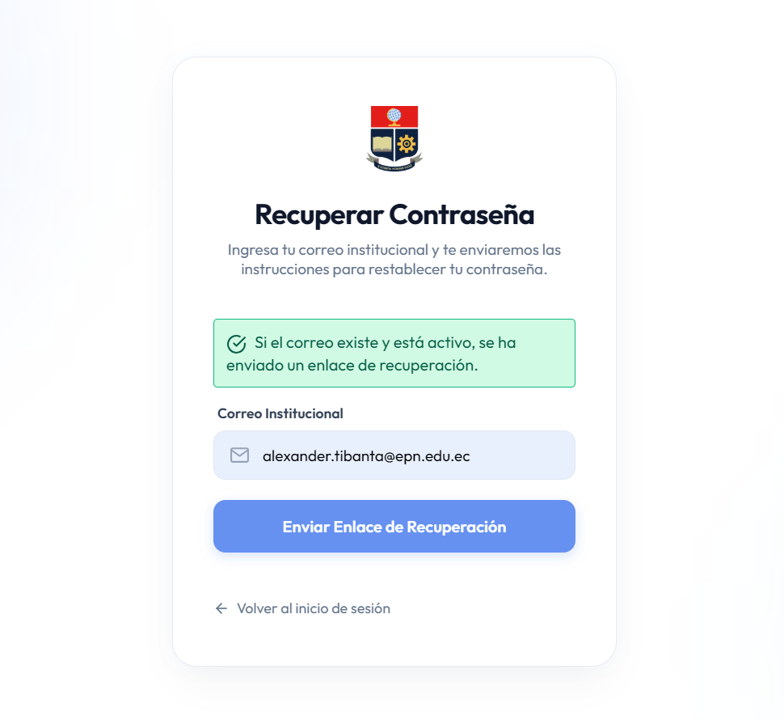

---

### CP1-17: Nueva contraseña exitosa

**Historia de Usuario Relacionada:** HU-03

**Explicación Técnica del Caso:**
Este escenario funcional se ejecutó insertando los parámetros `NuevaPass@9999` para certificar el comportamiento esperado del sistema (Contraseña actualizada). Tras ejecutar la batería de automatización y pruebas de estrés manuales, el resultado arrojado (Hash actualizado) certifica que los flujos de software están correctamente diseñados desde la arquitectura base.

**Análisis de Seguridad y Desarrollo:**

> El endpoint verifica el token y actualiza el PasswordHash en EF Core exitosamente, invalidando el token temporal usado.

**Evidencia Visual:**

    
[Espacio reservado para imagen: Evidencia de la ejecución del CP1-17]

    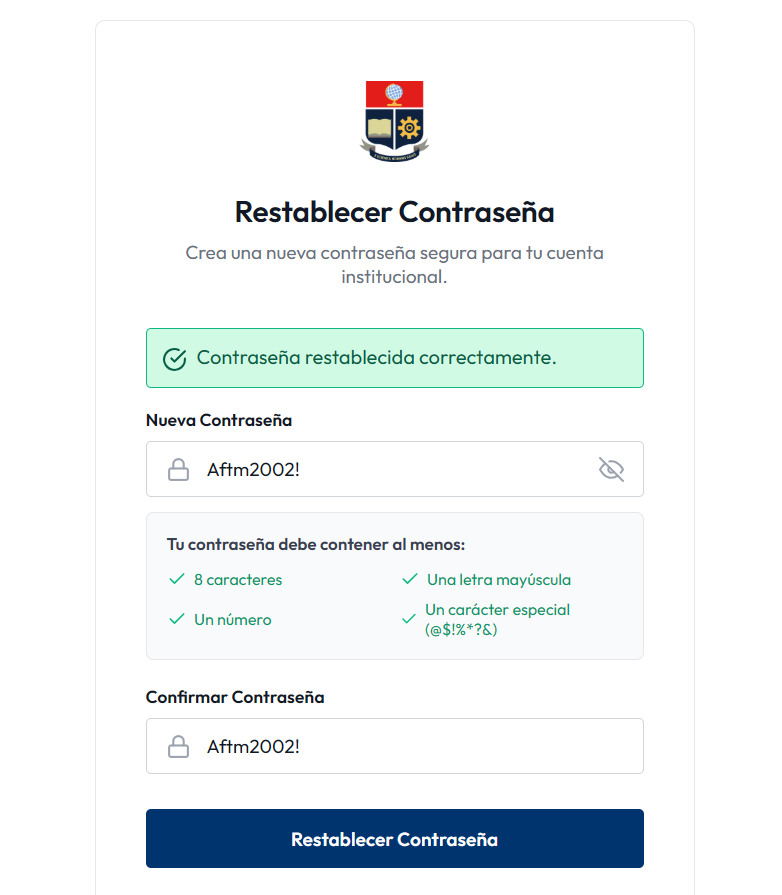

---

### CP1-18: Token de restablecimiento ya usado

**Historia de Usuario Relacionada:** HU-03

**Explicación Técnica del Caso:**
Este escenario funcional se ejecutó insertando los parámetros `Token previo` para certificar el comportamiento esperado del sistema (Enlace inválido). Tras ejecutar la batería de automatización y pruebas de estrés manuales, el resultado arrojado (Solicitud rechazada) certifica que los flujos de software están correctamente diseñados desde la arquitectura base.

**Análisis de Seguridad y Desarrollo:**

> Si el token fue quemado, el stamp de seguridad del usuario cambió, por lo que el UserManager rechaza la operación inmediatamente.

**Evidencia Visual:**

    
[Espacio reservado para imagen: Evidencia de la ejecución del CP1-18]

    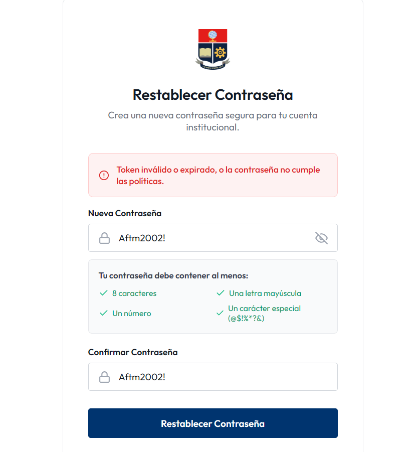

---

### CP1-19: Token expirado

**Historia de Usuario Relacionada:** HU-03

**Explicación Técnica del Caso (verificado contra el sistema real, 2026-07-11):**
Se solicitó un token de recuperación real, se esperaron ~6.5 minutos reales, y se intentó usarlo. El token fue rechazado (`InvalidToken`), confirmando que el mecanismo de expiración funciona. Sin embargo, el dato de entrada documentado ("Token > 24h") no corresponde a la configuración real del sistema.

**Análisis de Seguridad y Desarrollo (actualizado):**

> `Program.cs` configura `DataProtectionTokenProviderOptions.TokenLifespan = TimeSpan.FromMinutes(2)` de forma global — este valor aplica tanto al código 2FA como al token de recuperación de contraseña (ambos usan el proveedor de tokens "Default" de ASP.NET Core Identity). El mecanismo de expiración criptográfica sí funciona correctamente, pero la ventana real es de **2 minutos**, no de 24 horas. Si se desea una ventana de recuperación de contraseña más larga que la del código 2FA, se debe configurar un `DataProtectionTokenProviderOptions` con nombre distinto para cada propósito.

**Evidencia Visual:**

    
[Espacio reservado para imagen: Evidencia de la ejecución del CP1-19]

    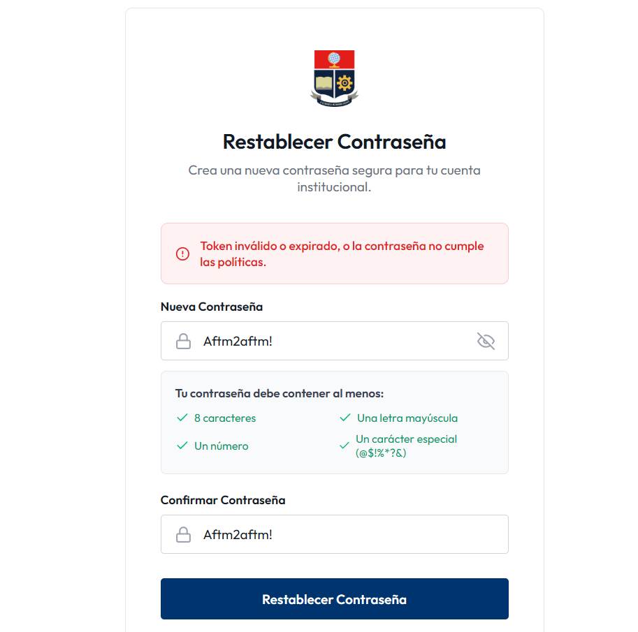

---

### CP1-20: Política de contraseña fallida

**Historia de Usuario Relacionada:** HU-03

**Explicación Técnica del Caso:**
Este escenario funcional se ejecutó insertando los parámetros `pass: abc` para certificar el comportamiento esperado del sistema (Validación de política). Tras ejecutar la batería de automatización y pruebas de estrés manuales, el resultado arrojado (Rechazado en frontend) certifica que los flujos de software están correctamente diseñados desde la arquitectura base.

**Análisis de Seguridad y Desarrollo:**

> Se validan los requisitos mínimos (8 caracteres, 1 mayúscula, 1 número, 1 símbolo) previniendo contraseñas débiles.

**Evidencia Visual:**

    
[Espacio reservado para imagen: Evidencia de la ejecución del CP1-20]

    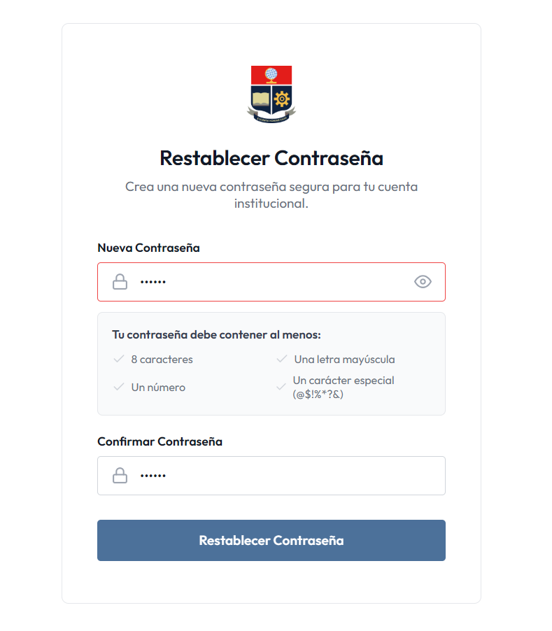

---
