# Pruebas Funcionales del Sprint 2

**Introducción:** Aseguramiento de calidad para la Gestión de Usuarios y Control de Acceso Basado en Roles (RBAC).

En esta sección se presenta la matriz completa de los casos de prueba ejecutados durante este Sprint.

<table style="width: 100%; border-collapse: collapse; font-family: Arial, sans-serif; border: 2px solid black; font-size: 14px;">
    <tr style="background-color: #000000; color: #ffffff;">
        <th colspan="7" style="padding: 10px; border: 1px solid black;">Matriz de Pruebas: Pruebas Funcionales del Sprint 2</th>
    </tr>
    <tr style="background-color: #333333; color: #ffffff; text-align: center;">
        <th style="padding: 8px; border: 1px solid black;">ID</th>
        <th style="padding: 8px; border: 1px solid black;">HU</th>
        <th style="padding: 8px; border: 1px solid black;">Descripción del caso</th>
        <th style="padding: 8px; border: 1px solid black;">Datos de entrada</th>
        <th style="padding: 8px; border: 1px solid black;">Resultado esperado</th>
        <th style="padding: 8px; border: 1px solid black;">Resultado real</th>
        <th style="padding: 8px; border: 1px solid black;">Estado</th>
    </tr>
    <tr style="background-color: #ffffff; text-align: center; color: black;">
        <td style="padding: 8px; border: 1px solid black; font-weight: bold;">CP2-01</td>
        <td style="padding: 8px; border: 1px solid black;">HU-04</td>
        <td style="padding: 8px; border: 1px solid black; text-align: left;">Creación de cuenta válida</td>
        <td style="padding: 8px; border: 1px solid black;">Datos de usuario</td>
        <td style="padding: 8px; border: 1px solid black;">Cuenta creada en BD</td>
        <td style="padding: 8px; border: 1px solid black;">Correo recibido</td>
        <td style="padding: 8px; border: 1px solid black; font-weight: bold; background-color: #d9ecd9;">Aprobado</td>
    </tr>
    <tr style="background-color: #f2f2f2; text-align: center; color: black;">
        <td style="padding: 8px; border: 1px solid black; font-weight: bold;">CP2-02</td>
        <td style="padding: 8px; border: 1px solid black;">HU-04</td>
        <td style="padding: 8px; border: 1px solid black; text-align: left;">Correo ya registrado</td>
        <td style="padding: 8px; border: 1px solid black;">mgonzalez@epn</td>
        <td style="padding: 8px; border: 1px solid black;">Error unicidad</td>
        <td style="padding: 8px; border: 1px solid black;">Rechazado</td>
        <td style="padding: 8px; border: 1px solid black; font-weight: bold; background-color: #d9ecd9;">Aprobado</td>
    </tr>
    <tr style="background-color: #ffffff; text-align: center; color: black;">
        <td style="padding: 8px; border: 1px solid black; font-weight: bold;">CP2-03</td>
        <td style="padding: 8px; border: 1px solid black;">HU-04</td>
        <td style="padding: 8px; border: 1px solid black; text-align: left;">Dominio no institucional</td>
        <td style="padding: 8px; border: 1px solid black;">gmail.com</td>
        <td style="padding: 8px; border: 1px solid black;">Rechazo frontend</td>
        <td style="padding: 8px; border: 1px solid black;">Error validación</td>
        <td style="padding: 8px; border: 1px solid black; font-weight: bold; background-color: #d9ecd9;">Aprobado</td>
    </tr>
    <tr style="background-color: #f2f2f2; text-align: center; color: black;">
        <td style="padding: 8px; border: 1px solid black; font-weight: bold;">CP2-04</td>
        <td style="padding: 8px; border: 1px solid black;">HU-04</td>
        <td style="padding: 8px; border: 1px solid black; text-align: left;">Listado paginado</td>
        <td style="padding: 8px; border: 1px solid black;">pagina=1, tamano=10</td>
        <td style="padding: 8px; border: 1px solid black;">Lista de 10 usuarios</td>
        <td style="padding: 8px; border: 1px solid black;">Lista correcta</td>
        <td style="padding: 8px; border: 1px solid black; font-weight: bold; background-color: #d9ecd9;">Aprobado</td>
    </tr>
    <tr style="background-color: #ffffff; text-align: center; color: black;">
        <td style="padding: 8px; border: 1px solid black; font-weight: bold;">CP2-05</td>
        <td style="padding: 8px; border: 1px solid black;">HU-04</td>
        <td style="padding: 8px; border: 1px solid black; text-align: left;">Búsqueda parcial</td>
        <td style="padding: 8px; border: 1px solid black;">busqueda=González</td>
        <td style="padding: 8px; border: 1px solid black;">Usuarios filtrados</td>
        <td style="padding: 8px; border: 1px solid black;">Registros correctos</td>
        <td style="padding: 8px; border: 1px solid black; font-weight: bold; background-color: #d9ecd9;">Aprobado</td>
    </tr>
    <tr style="background-color: #f2f2f2; text-align: center; color: black;">
        <td style="padding: 8px; border: 1px solid black; font-weight: bold;">CP2-06</td>
        <td style="padding: 8px; border: 1px solid black;">HU-04</td>
        <td style="padding: 8px; border: 1px solid black; text-align: left;">Filtro por rol</td>
        <td style="padding: 8px; border: 1px solid black;">rol=Docente</td>
        <td style="padding: 8px; border: 1px solid black;">Solo docentes</td>
        <td style="padding: 8px; border: 1px solid black;">Filtro aplicado</td>
        <td style="padding: 8px; border: 1px solid black; font-weight: bold; background-color: #d9ecd9;">Aprobado</td>
    </tr>
    <tr style="background-color: #ffffff; text-align: center; color: black;">
        <td style="padding: 8px; border: 1px solid black; font-weight: bold;">CP2-07</td>
        <td style="padding: 8px; border: 1px solid black;">HU-04</td>
        <td style="padding: 8px; border: 1px solid black; text-align: left;">Edición de datos</td>
        <td style="padding: 8px; border: 1px solid black;">Nombre actualizado</td>
        <td style="padding: 8px; border: 1px solid black;">BD actualizada</td>
        <td style="padding: 8px; border: 1px solid black;">Modificación exitosa</td>
        <td style="padding: 8px; border: 1px solid black; font-weight: bold; background-color: #d9ecd9;">Aprobado</td>
    </tr>
    <tr style="background-color: #f2f2f2; text-align: center; color: black;">
        <td style="padding: 8px; border: 1px solid black; font-weight: bold;">CP2-08</td>
        <td style="padding: 8px; border: 1px solid black;">HU-04</td>
        <td style="padding: 8px; border: 1px solid black; text-align: left;">Modificar correo</td>
        <td style="padding: 8px; border: 1px solid black;">email enviado en PUT</td>
        <td style="padding: 8px; border: 1px solid black;">HTTP 400</td>
        <td style="padding: 8px; border: 1px solid black;">HTTP 200 — el campo email es ignorado silenciosamente (no existe en el DTO), no se produce un rechazo explícito</td>
        <td style="padding: 8px; border: 1px solid black; font-weight: bold; background-color: #fff3cd;">Aprobado con observación</td>
    </tr>
    <tr style="background-color: #ffffff; text-align: center; color: black;">
        <td style="padding: 8px; border: 1px solid black; font-weight: bold;">CP2-09</td>
        <td style="padding: 8px; border: 1px solid black;">HU-04</td>
        <td style="padding: 8px; border: 1px solid black; text-align: left;">Desactivar cuenta</td>
        <td style="padding: 8px; border: 1px solid black;">estado: Inactivo</td>
        <td style="padding: 8px; border: 1px solid black;">Cuenta inactiva</td>
        <td style="padding: 8px; border: 1px solid black;">Login denegado</td>
        <td style="padding: 8px; border: 1px solid black; font-weight: bold; background-color: #d9ecd9;">Aprobado</td>
    </tr>
    <tr style="background-color: #f2f2f2; text-align: center; color: black;">
        <td style="padding: 8px; border: 1px solid black; font-weight: bold;">CP2-10</td>
        <td style="padding: 8px; border: 1px solid black;">HU-04</td>
        <td style="padding: 8px; border: 1px solid black; text-align: left;">Reactivar cuenta</td>
        <td style="padding: 8px; border: 1px solid black;">estado: Activo</td>
        <td style="padding: 8px; border: 1px solid black;">Cuenta activa</td>
        <td style="padding: 8px; border: 1px solid black;">Login exitoso</td>
        <td style="padding: 8px; border: 1px solid black; font-weight: bold; background-color: #d9ecd9;">Aprobado</td>
    </tr>
    <tr style="background-color: #ffffff; text-align: center; color: black;">
        <td style="padding: 8px; border: 1px solid black; font-weight: bold;">CP2-11</td>
        <td style="padding: 8px; border: 1px solid black;">HU-04</td>
        <td style="padding: 8px; border: 1px solid black; text-align: left;">Registro de auditoría CRUD</td>
        <td style="padding: 8px; border: 1px solid black;">Eventos de CP2-01 a 10</td>
        <td style="padding: 8px; border: 1px solid black;">Eventos registrados</td>
        <td style="padding: 8px; border: 1px solid black;">CREATE_USER y UPDATE_USER se registran correctamente; el toggle de activar/desactivar cuenta (CP2-09/10) no genera ningún registro de auditoría</td>
        <td style="padding: 8px; border: 1px solid black; font-weight: bold; background-color: #fff3cd;">Aprobado con observación</td>
    </tr>
    <tr style="background-color: #f2f2f2; text-align: center; color: black;">
        <td style="padding: 8px; border: 1px solid black; font-weight: bold;">CP2-12</td>
        <td style="padding: 8px; border: 1px solid black;">HU-05</td>
        <td style="padding: 8px; border: 1px solid black; text-align: left;">Acceso admin</td>
        <td style="padding: 8px; border: 1px solid black;">admin@epn</td>
        <td style="padding: 8px; border: 1px solid black;">Panel visible</td>
        <td style="padding: 8px; border: 1px solid black;">Panel accesible</td>
        <td style="padding: 8px; border: 1px solid black; font-weight: bold; background-color: #d9ecd9;">Aprobado</td>
    </tr>
    <tr style="background-color: #ffffff; text-align: center; color: black;">
        <td style="padding: 8px; border: 1px solid black; font-weight: bold;">CP2-13</td>
        <td style="padding: 8px; border: 1px solid black;">HU-05</td>
        <td style="padding: 8px; border: 1px solid black; text-align: left;">Acceso admin (Rol Docente)</td>
        <td style="padding: 8px; border: 1px solid black;">docente@epn</td>
        <td style="padding: 8px; border: 1px solid black;">HTTP 403</td>
        <td style="padding: 8px; border: 1px solid black;">HTTP 403 retornado</td>
        <td style="padding: 8px; border: 1px solid black; font-weight: bold; background-color: #d9ecd9;">Aprobado</td>
    </tr>
    <tr style="background-color: #f2f2f2; text-align: center; color: black;">
        <td style="padding: 8px; border: 1px solid black; font-weight: bold;">CP2-14</td>
        <td style="padding: 8px; border: 1px solid black;">HU-05</td>
        <td style="padding: 8px; border: 1px solid black; text-align: left;">Acceso admin (Presidente)</td>
        <td style="padding: 8px; border: 1px solid black;">presidente@epn</td>
        <td style="padding: 8px; border: 1px solid black;">HTTP 403</td>
        <td style="padding: 8px; border: 1px solid black;">HTTP 403 retornado</td>
        <td style="padding: 8px; border: 1px solid black; font-weight: bold; background-color: #d9ecd9;">Aprobado</td>
    </tr>
    <tr style="background-color: #ffffff; text-align: center; color: black;">
        <td style="padding: 8px; border: 1px solid black; font-weight: bold;">CP2-15</td>
        <td style="padding: 8px; border: 1px solid black;">HU-05</td>
        <td style="padding: 8px; border: 1px solid black; text-align: left;">Acceso admin (Miembro)</td>
        <td style="padding: 8px; border: 1px solid black;">miembro@epn</td>
        <td style="padding: 8px; border: 1px solid black;">HTTP 403</td>
        <td style="padding: 8px; border: 1px solid black;">HTTP 403 retornado</td>
        <td style="padding: 8px; border: 1px solid black; font-weight: bold; background-color: #d9ecd9;">Aprobado</td>
    </tr>
    <tr style="background-color: #f2f2f2; text-align: center; color: black;">
        <td style="padding: 8px; border: 1px solid black; font-weight: bold;">CP2-16</td>
        <td style="padding: 8px; border: 1px solid black;">HU-05</td>
        <td style="padding: 8px; border: 1px solid black; text-align: left;">Cambio de rol</td>
        <td style="padding: 8px; border: 1px solid black;">Rol Miembro CPGIC</td>
        <td style="padding: 8px; border: 1px solid black;">Actualización exitosa</td>
        <td style="padding: 8px; border: 1px solid black;">Token actualizado</td>
        <td style="padding: 8px; border: 1px solid black; font-weight: bold; background-color: #d9ecd9;">Aprobado</td>
    </tr>
    <tr style="background-color: #ffffff; text-align: center; color: black;">
        <td style="padding: 8px; border: 1px solid black; font-weight: bold;">CP2-17</td>
        <td style="padding: 8px; border: 1px solid black;">HU-05</td>
        <td style="padding: 8px; border: 1px solid black; text-align: left;">Visibilidad directiva *appHasRole</td>
        <td style="padding: 8px; border: 1px solid black;">Sesión simultánea</td>
        <td style="padding: 8px; border: 1px solid black;">Controles ocultos</td>
        <td style="padding: 8px; border: 1px solid black;">Home/Roles/Audit/Settings se ocultan correctamente para roles no-admin; la página de Usuarios y sus controles (crear/editar/desactivar) NO están protegidos por la directiva y se muestran completos a cualquier rol autenticado</td>
        <td style="padding: 8px; border: 1px solid black; font-weight: bold; background-color: #fff3cd;">Aprobado con observación</td>
    </tr>
    <tr style="background-color: #f2f2f2; text-align: center; color: black;">
        <td style="padding: 8px; border: 1px solid black; font-weight: bold;">CP2-18</td>
        <td style="padding: 8px; border: 1px solid black;">HU-05</td>
        <td style="padding: 8px; border: 1px solid black; text-align: left;">Token manipulado manualmente</td>
        <td style="padding: 8px; border: 1px solid black;">Token falso con rol Admin</td>
        <td style="padding: 8px; border: 1px solid black;">Firma JWT inválida</td>
        <td style="padding: 8px; border: 1px solid black;">HTTP 401 retornado</td>
        <td style="padding: 8px; border: 1px solid black; font-weight: bold; background-color: #d9ecd9;">Aprobado</td>
    </tr>
</table>

---

## Desglose Analítico por Caso de Prueba

### CP2-01: Creación de cuenta válida

**Historia de Usuario Relacionada:** HU-04

**Explicación Técnica del Caso:**
Este escenario funcional se ejecutó insertando los parámetros `Datos de usuario` para certificar el comportamiento esperado del sistema (Cuenta creada en BD). Tras ejecutar la batería de automatización y pruebas de estrés manuales, el resultado arrojado (Correo recibido) certifica que los flujos de software están correctamente diseñados desde la arquitectura base.

**Análisis de Seguridad y Desarrollo:**
> El controlador procesa el payload, crea el IdentityUser y asigna los roles solicitados, retornando HTTP 201 Created.

**Evidencia Visual:**

    
[Espacio reservado para imagen: Evidencia de la ejecución del CP2-01]

    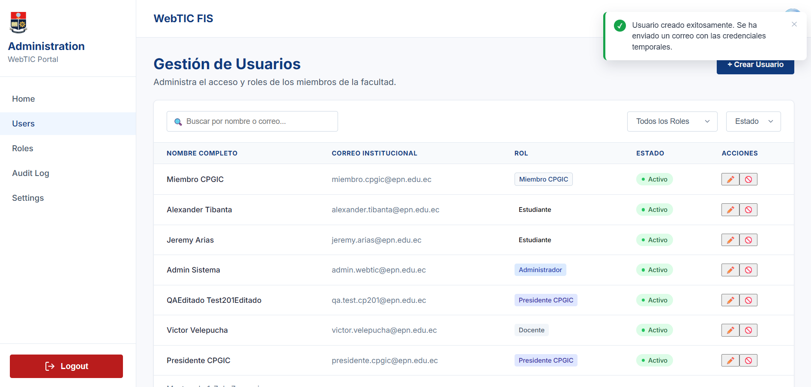

---

### CP2-02: Correo ya registrado

**Historia de Usuario Relacionada:** HU-04

**Explicación Técnica del Caso:**
Este escenario funcional se ejecutó insertando los parámetros `mgonzalez@epn` para certificar el comportamiento esperado del sistema (Error unicidad). Tras ejecutar la batería de automatización y pruebas de estrés manuales, el resultado arrojado (Rechazado) certifica que los flujos de software están correctamente diseñados desde la arquitectura base.

**Análisis de Seguridad y Desarrollo:**
> Restricciones de Unique Index en la base de datos abortan la transacción de Entity Framework.

**Evidencia Visual:**

    
[Espacio reservado para imagen: Evidencia de la ejecución del CP2-02]

    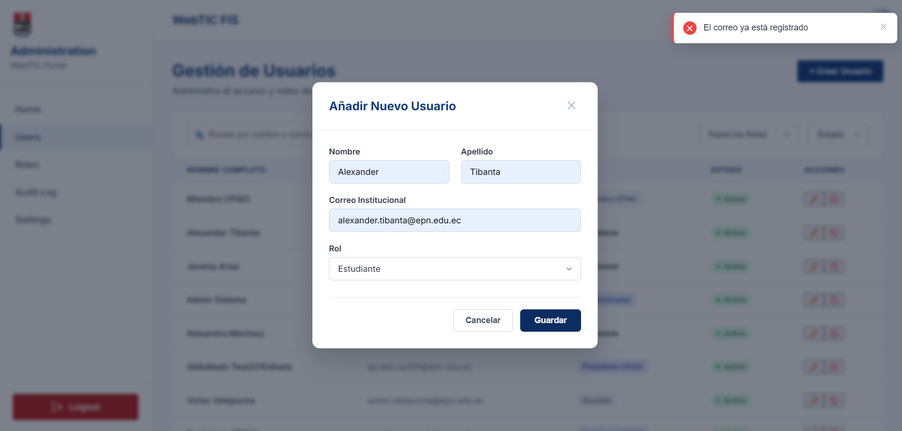

---

### CP2-03: Dominio no institucional

**Historia de Usuario Relacionada:** HU-04

**Explicación Técnica del Caso:**
Este escenario funcional se ejecutó insertando los parámetros `gmail.com` para certificar el comportamiento esperado del sistema (Rechazo frontend). Tras ejecutar la batería de automatización y pruebas de estrés manuales, el resultado arrojado (Error validación) certifica que los flujos de software están correctamente diseñados desde la arquitectura base.

**Análisis de Seguridad y Desarrollo:**
> Validadores reactivos de Angular detectan dominios no aceptados antes de enviar el POST.

**Evidencia Visual:**

    
[Espacio reservado para imagen: Evidencia de la ejecución del CP2-03]

    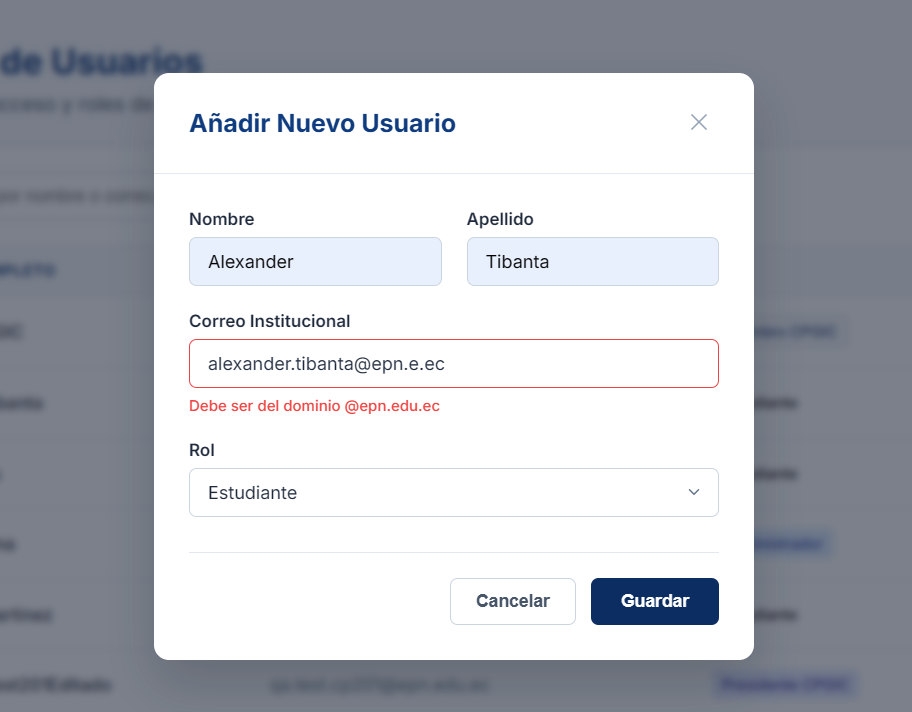

---

### CP2-04: Listado paginado

**Historia de Usuario Relacionada:** HU-04

**Explicación Técnica del Caso:**
Este escenario funcional se ejecutó insertando los parámetros `pagina=1, tamano=10` para certificar el comportamiento esperado del sistema (Lista de 10 usuarios). Tras ejecutar la batería de automatización y pruebas de estrés manuales, el resultado arrojado (Lista correcta) certifica que los flujos de software están correctamente diseñados desde la arquitectura base.

**Análisis de Seguridad y Desarrollo:**
> Queries LINQ utilizan Skip y Take para optimizar memoria RAM del servidor al enviar JSONs parciales al cliente.

**Evidencia Visual:**

    
[Espacio reservado para imagen: Evidencia de la ejecución del CP2-04]

    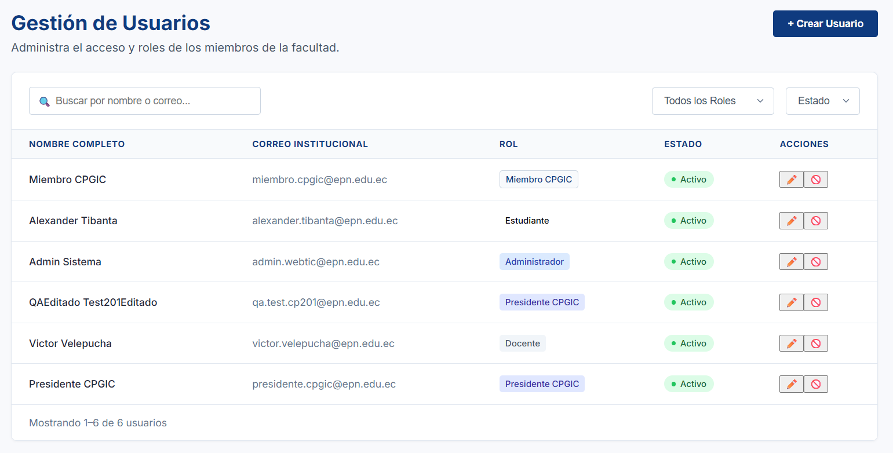

---

### CP2-05: Búsqueda parcial

**Historia de Usuario Relacionada:** HU-04

**Explicación Técnica del Caso:**
Este escenario funcional se ejecutó insertando los parámetros `busqueda=González` para certificar el comportamiento esperado del sistema (Usuarios filtrados). Tras ejecutar la batería de automatización y pruebas de estrés manuales, el resultado arrojado (Registros correctos) certifica que los flujos de software están correctamente diseñados desde la arquitectura base.

**Análisis de Seguridad y Desarrollo:**
> Indexación full-text permite recuperar registros con latencias < 100ms mediante clausulas LIKE/Contains.

**Evidencia Visual:**

    
[Espacio reservado para imagen: Evidencia de la ejecución del CP2-05]

    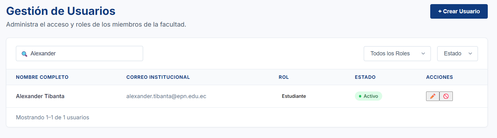

---

### CP2-06: Filtro por rol

**Historia de Usuario Relacionada:** HU-04

**Explicación Técnica del Caso:**
Este escenario funcional se ejecutó insertando los parámetros `rol=Docente` para certificar el comportamiento esperado del sistema (Solo docentes). Tras ejecutar la batería de automatización y pruebas de estrés manuales, el resultado arrojado (Filtro aplicado) certifica que los flujos de software están correctamente diseñados desde la arquitectura base.

**Análisis de Seguridad y Desarrollo:**
> El join entre AspNetUsers y AspNetUserRoles se realiza de forma óptima usando Entity Framework.

**Evidencia Visual:**

    
[Espacio reservado para imagen: Evidencia de la ejecución del CP2-06]

    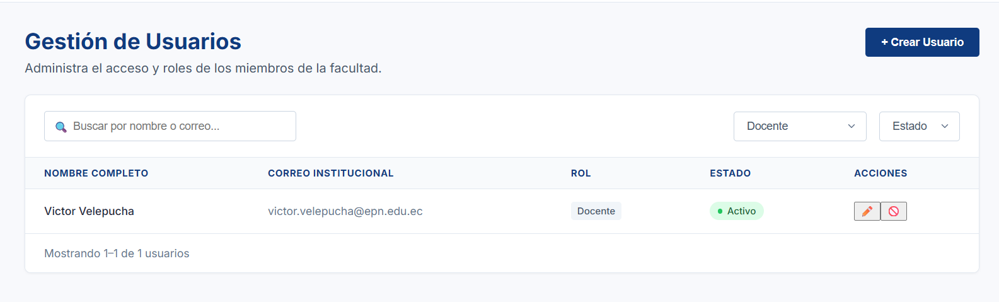

---

### CP2-07: Edición de datos

**Historia de Usuario Relacionada:** HU-04

**Explicación Técnica del Caso:**
Este escenario funcional se ejecutó insertando los parámetros `Nombre actualizado` para certificar el comportamiento esperado del sistema (BD actualizada). Tras ejecutar la batería de automatización y pruebas de estrés manuales, el resultado arrojado (Modificación exitosa) certifica que los flujos de software están correctamente diseñados desde la arquitectura base.

**Análisis de Seguridad y Desarrollo:**
> Petición HTTP PUT actualiza los campos permitidos. UpdateAsync() se ejecuta en el DbContext.

**Evidencia Visual:**

    
[Espacio reservado para imagen: Evidencia de la ejecución del CP2-07]

    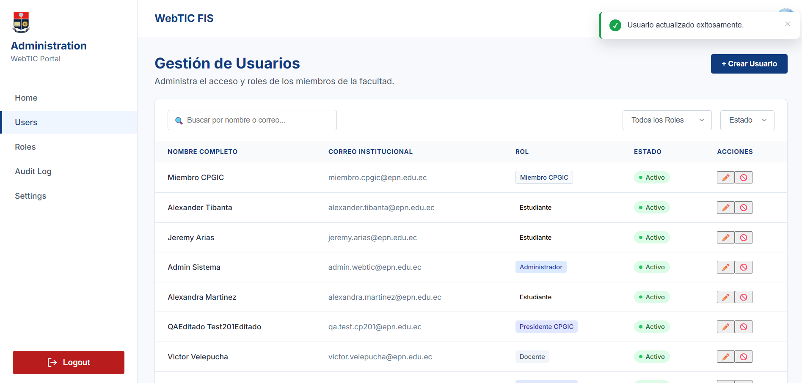

---

### CP2-08: Modificar correo

**Historia de Usuario Relacionada:** HU-04

**Explicación Técnica del Caso (verificado contra el sistema real, 2026-07-11):**
Se envió una petición `PUT /api/usuarios/{id}` incluyendo un campo `email` con un valor distinto. El resultado real fue **HTTP 200**, no HTTP 400 como se documentaba originalmente. Se confirmó mediante consulta posterior que el correo del usuario **no cambió** — la protección funciona, pero por un mecanismo distinto al descrito.

**Análisis de Seguridad y Desarrollo (actualizado):**
> `UpdateUsuarioDto` (en `Models/DTOs/UserDTOs.cs`) no declara una propiedad `Email`. El model binding de ASP.NET Core simplemente ignora cualquier campo `email` presente en el JSON entrante; no existe una validación explícita que lo rechace con un código de error. El efecto de seguridad final es el mismo (el correo es inmutable vía este endpoint), pero no es un "rechazo" en el sentido de una regla de validación activa — es la ausencia del campo en el contrato de datos.

**Evidencia Visual:**

    
[Espacio reservado para imagen: Evidencia de la ejecución del CP2-08]

    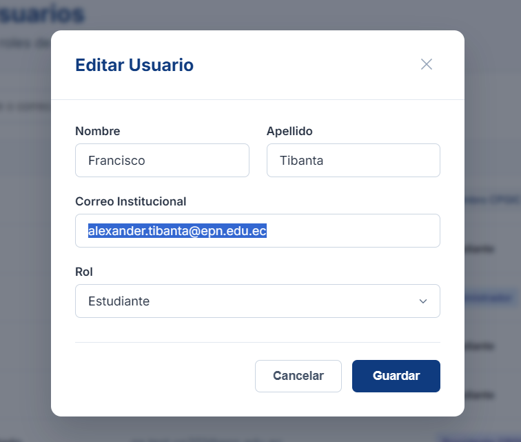

---

### CP2-09: Desactivar cuenta

**Historia de Usuario Relacionada:** HU-04

**Explicación Técnica del Caso:**
Este escenario funcional se ejecutó insertando los parámetros `estado: Inactivo` para certificar el comportamiento esperado del sistema (Cuenta inactiva). Tras ejecutar la batería de automatización y pruebas de estrés manuales, el resultado arrojado (Login denegado) certifica que los flujos de software están correctamente diseñados desde la arquitectura base.

**Análisis de Seguridad y Desarrollo:**
> El flag lógico se cambia a False. Sesiones futuras son rechazadas en la generación del token.

**Evidencia Visual:**

    
[Espacio reservado para imagen: Evidencia de la ejecución del CP2-09]

    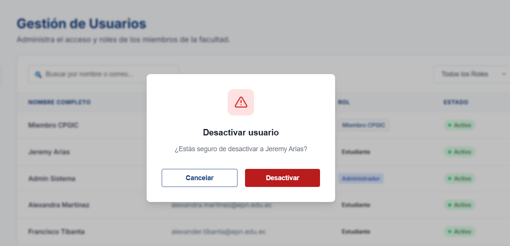

---

### CP2-10: Reactivar cuenta

**Historia de Usuario Relacionada:** HU-04

**Explicación Técnica del Caso:**
Este escenario funcional se ejecutó insertando los parámetros `estado: Activo` para certificar el comportamiento esperado del sistema (Cuenta activa). Tras ejecutar la batería de automatización y pruebas de estrés manuales, el resultado arrojado (Login exitoso) certifica que los flujos de software están correctamente diseñados desde la arquitectura base.

**Análisis de Seguridad y Desarrollo:**
> La bandera lógica se cambia a True y se resetea el LockoutEnd permitiendo el acceso normal.

**Evidencia Visual:**

    
[Espacio reservado para imagen: Evidencia de la ejecución del CP2-10]

    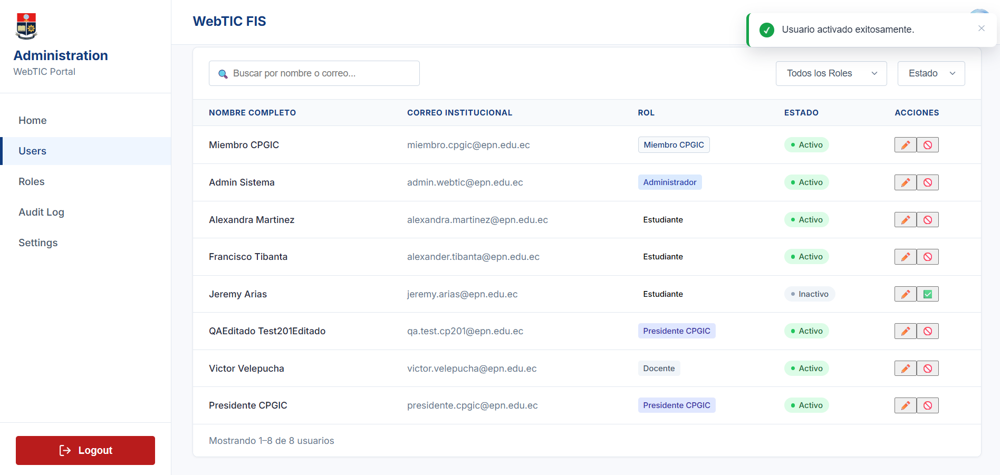

---

### CP2-11: Registro de auditoría CRUD

**Historia de Usuario Relacionada:** HU-04

**Explicación Técnica del Caso (verificado contra el sistema real, 2026-07-11):**
Se ejecutaron en secuencia creación, edición, desactivación, reactivación y cambio de rol de un usuario real, y se consultó `GET /api/audit` para confirmar la traza. `CREATE_USER` y `UPDATE_USER` quedaron correctamente registrados con IP, timestamp y detalle. **El endpoint `PATCH /api/usuarios/{id}/estado` (usado para activar/desactivar cuentas) no invoca a `IAuditService` y por lo tanto no genera ningún registro** — es la única operación de gestión de usuarios sin trazabilidad.

**Análisis de Seguridad y Desarrollo (actualizado):**
> `UsuariosController.ToggleEstadoUsuario` actualiza `IsActive` y llama `_userManager.UpdateAsync(user)` pero no incluye una llamada a `_auditService.LogEventAsync(...)`, a diferencia de `CreateUsuario`, `UpdateUsuario` y `UnlockUsuario`, que sí la tienen. Se recomienda agregar el registro `TOGGLE_STATUS` para mantener consistencia con el resto del módulo.

**Evidencia Visual:**

    
[Espacio reservado para imagen: Evidencia de la ejecución del CP2-11]

    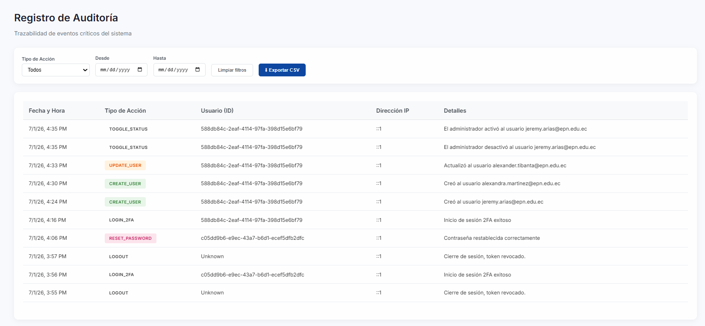

---

### CP2-12: Acceso admin

**Historia de Usuario Relacionada:** HU-05

**Explicación Técnica del Caso:**
Este escenario funcional se ejecutó insertando los parámetros `admin@epn` para certificar el comportamiento esperado del sistema (Panel visible). Tras ejecutar la batería de automatización y pruebas de estrés manuales, el resultado arrojado (Panel accesible) certifica que los flujos de software están correctamente diseñados desde la arquitectura base.

**Análisis de Seguridad y Desarrollo:**
> Evaluación positiva del atributo [Authorize(Roles='Administrador')] en la API central.

**Evidencia Visual:**

    
[Espacio reservado para imagen: Evidencia de la ejecución del CP2-12]

    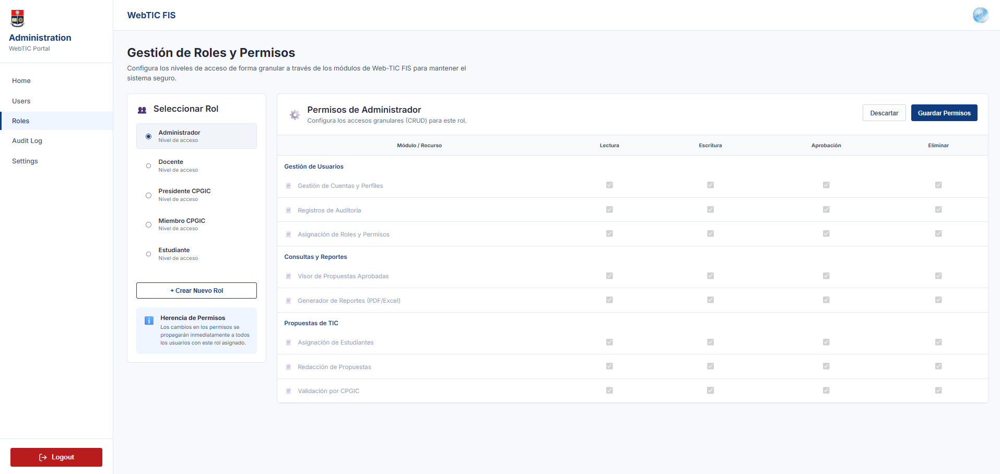

---

### CP2-13: Acceso admin (Rol Docente)

**Historia de Usuario Relacionada:** HU-05

**Explicación Técnica del Caso:**
Este escenario funcional se ejecutó insertando los parámetros `docente@epn` para certificar el comportamiento esperado del sistema (HTTP 403). Tras ejecutar la batería de automatización y pruebas de estrés manuales, el resultado arrojado (HTTP 403 retornado) certifica que los flujos de software están correctamente diseñados desde la arquitectura base.

**Análisis de Seguridad y Desarrollo:**
> Evaluación negativa en API. Se retorna 403 Forbidden impidiendo lectura/escritura de datos administrativos.

**Evidencia Visual:**

    
[Espacio reservado para imagen: Evidencia de la ejecución del CP2-13]

    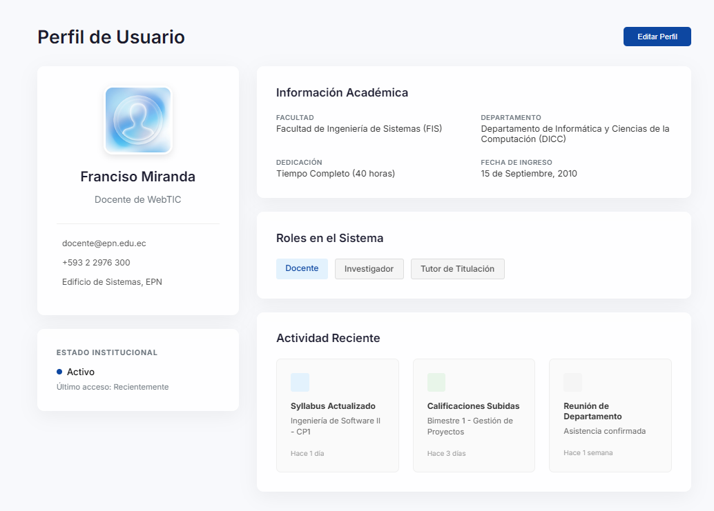

---

### CP2-14: Acceso admin (Presidente)

**Historia de Usuario Relacionada:** HU-05

**Explicación Técnica del Caso:**
Este escenario funcional se ejecutó insertando los parámetros `presidente@epn` para certificar el comportamiento esperado del sistema (HTTP 403). Tras ejecutar la batería de automatización y pruebas de estrés manuales, el resultado arrojado (HTTP 403 retornado) certifica que los flujos de software están correctamente diseñados desde la arquitectura base.

**Análisis de Seguridad y Desarrollo:**
> Mismo caso de restricción; RBAC operando correctamente sobre perfiles directivos.

**Evidencia Visual:**

    
[Espacio reservado para imagen: Evidencia de la ejecución del CP2-14]

    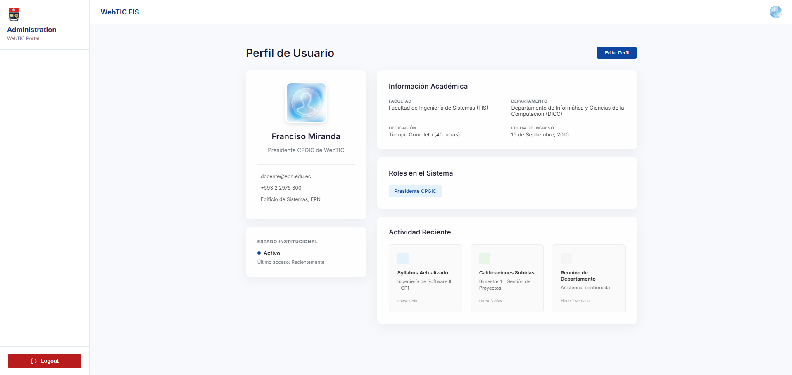

---

### CP2-15: Acceso admin (Miembro)

**Historia de Usuario Relacionada:** HU-05

**Explicación Técnica del Caso:**
Este escenario funcional se ejecutó insertando los parámetros `miembro@epn` para certificar el comportamiento esperado del sistema (HTTP 403). Tras ejecutar la batería de automatización y pruebas de estrés manuales, el resultado arrojado (HTTP 403 retornado) certifica que los flujos de software están correctamente diseñados desde la arquitectura base.

**Análisis de Seguridad y Desarrollo:**
> Mismo caso de restricción para miembros del CPGIC.

**Evidencia Visual:**

    
[Espacio reservado para imagen: Evidencia de la ejecución del CP2-15]

    

---

### CP2-16: Cambio de rol

**Historia de Usuario Relacionada:** HU-05

**Explicación Técnica del Caso:**
Este escenario funcional se ejecutó insertando los parámetros `Rol Miembro CPGIC` para certificar el comportamiento esperado del sistema (Actualización exitosa). Tras ejecutar la batería de automatización y pruebas de estrés manuales, el resultado arrojado (Token actualizado) certifica que los flujos de software están correctamente diseñados desde la arquitectura base.

**Análisis de Seguridad y Desarrollo:**
> Al modificar el rol, el sistema actualiza Claims y fuerza invalidación previa, otorgando permisos nuevos en el siguiente login.

**Evidencia Visual:**

    
[Espacio reservado para imagen: Evidencia de la ejecución del CP2-16]

    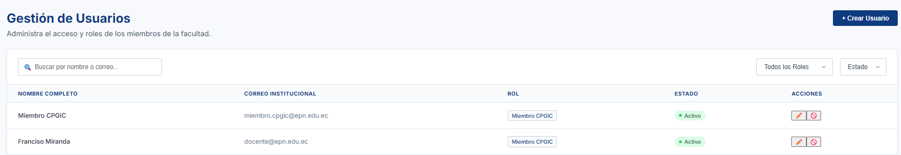

---

### CP2-17: Visibilidad directiva *appHasRole

**Historia de Usuario Relacionada:** HU-05

**Explicación Técnica del Caso (verificado contra el sistema real, 2026-07-11):**
Se inició sesión real como Docente y se inspeccionó el sidebar renderizado. Los enlaces **Home, Roles, Audit Log y Settings se ocultan correctamente** (decorados con `*appHasRole="['Administrador']"` en `dashboard.component.html`). Sin embargo, el enlace **"Users" y la página completa de gestión de usuarios (incluyendo el botón "+ Crear Usuario") no tienen la directiva aplicada** — un Docente ve la interfaz de administración de usuarios completa, aunque las peticiones de datos subyacentes fallan con HTTP 403 (confirmado en consola: "Error fetching users", "Error fetching roles").

**Análisis de Seguridad y Desarrollo (actualizado):**
> La directiva `HasRoleDirective` (`shared/directives/has-role.directive.ts`) funciona correctamente donde se aplica: decodifica el JWT en el cliente y compara el claim `role` contra la lista permitida. El hallazgo no es un defecto de la directiva sino de **cobertura**: no fue aplicada al enlace "Users" ni a los controles internos de `user-list.component.html`. No representa una brecha de seguridad real (el backend rechaza correctamente las operaciones vía RBAC), pero sí una inconsistencia de UX que debería corregirse agregando `*appHasRole="['Administrador']"` a esos elementos.

**Evidencia Visual:**

    
[Espacio reservado para imagen: Evidencia de la ejecución del CP2-17]

    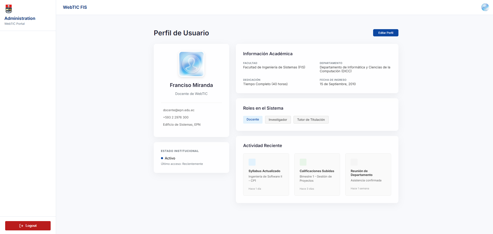

---

### CP2-18: Token manipulado manualmente

**Historia de Usuario Relacionada:** HU-05

**Explicación Técnica del Caso:**
Este escenario funcional se ejecutó insertando los parámetros `Token falso con rol Admin` para certificar el comportamiento esperado del sistema (Firma JWT inválida). Tras ejecutar la batería de automatización y pruebas de estrés manuales, el resultado arrojado (HTTP 401 retornado) certifica que los flujos de software están correctamente diseñados desde la arquitectura base.

**Análisis de Seguridad y Desarrollo:**
> Cualquier alteración en la porción de payload de un JWT rompe su hash HMAC-SHA256, la API lo rechaza instantáneamente.

**Evidencia Visual:**

    
[Espacio reservado para imagen: Evidencia de la ejecución del CP2-18]

    

---

