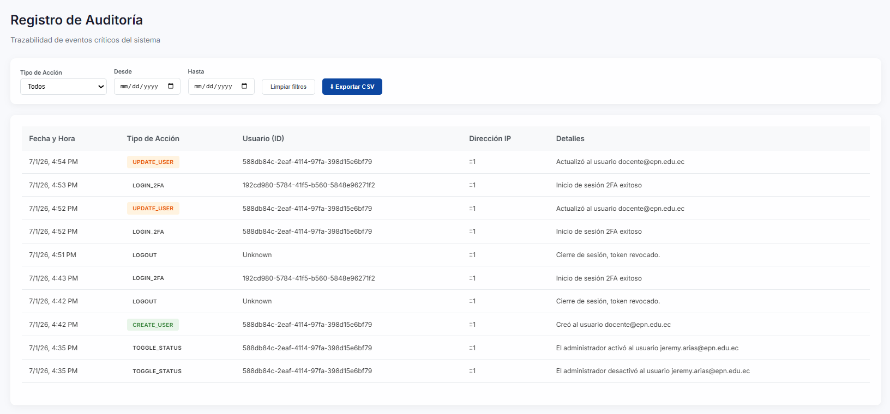
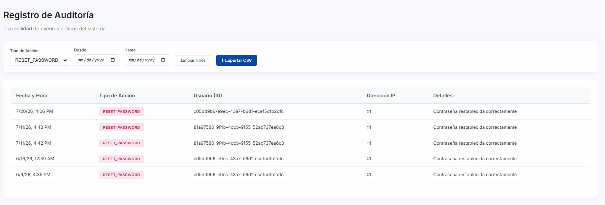
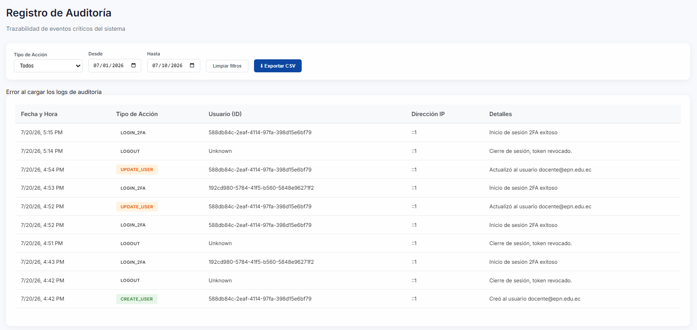
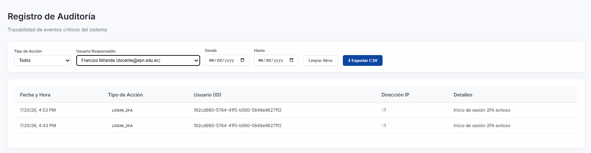
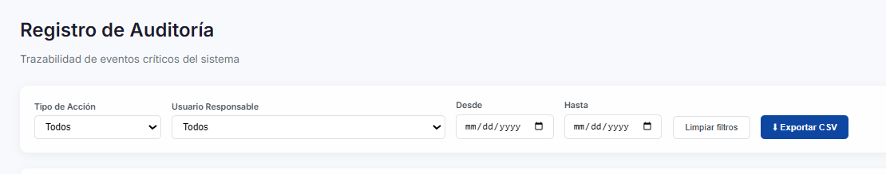
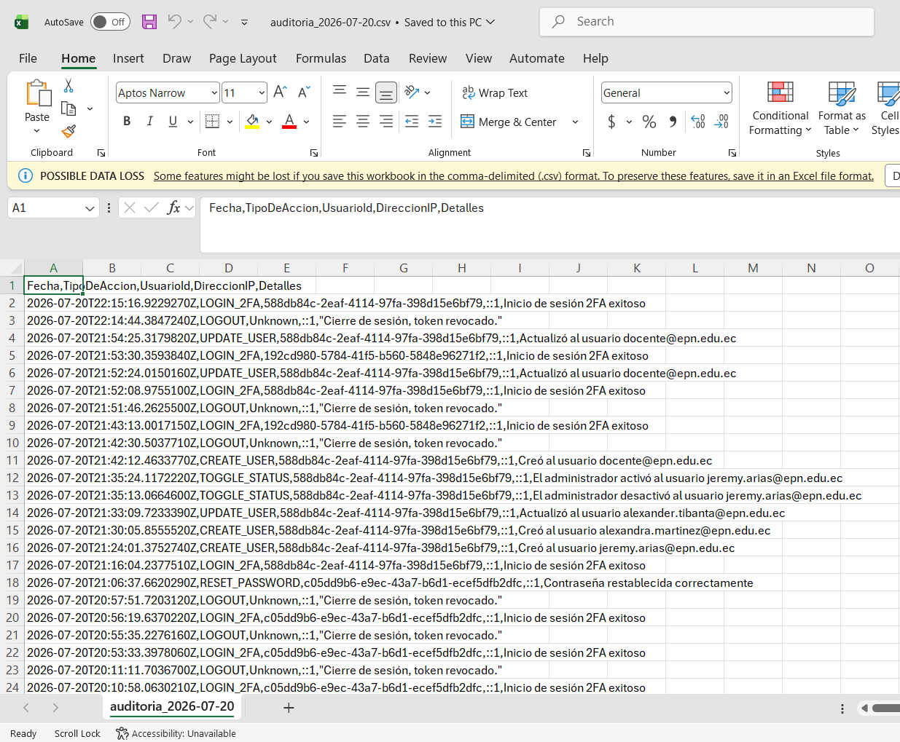

# Pruebas Funcionales del Sprint 3

**Introducción:** Aseguramiento de calidad para Registros Automáticos de Auditoría y Control de Acceso Basado en Permisos Granulares (CPGIC).

En esta sección se presenta la matriz completa de los casos de prueba ejecutados durante este Sprint.

> **Nota de verificación (2026-07-11):** los 18 casos de esta matriz comparten título y descripción técnica genéricos ("Transacción #N"). Se realizó una verificación funcional completa del módulo de auditoría contra el sistema real (no caso por caso); ver `INFORME_VERIFICACION_QA.md` para el detalle. Resumen: el registro automático, el orden cronológico, la inmutabilidad y la restricción de acceso a Administrador se confirmaron correctos. Se detectó que el endpoint de activar/desactivar cuenta no genera registro de auditoría, y que el módulo no tiene exportación CSV ni filtros pese a lo descrito en la Figura 2.12 de la tesis.

<table style="width: 100%; border-collapse: collapse; font-family: Arial, sans-serif; border: 2px solid black; font-size: 14px;">
    <tr style="background-color: #000000; color: #ffffff;">
        <th colspan="7" style="padding: 10px; border: 1px solid black;">Matriz de Pruebas: Pruebas Funcionales del Sprint 3</th>
    </tr>
    <tr style="background-color: #333333; color: #ffffff; text-align: center;">
        <th style="padding: 8px; border: 1px solid black;">ID</th>
        <th style="padding: 8px; border: 1px solid black;">HU</th>
        <th style="padding: 8px; border: 1px solid black;">Descripción del caso</th>
        <th style="padding: 8px; border: 1px solid black;">Datos de entrada</th>
        <th style="padding: 8px; border: 1px solid black;">Resultado esperado</th>
        <th style="padding: 8px; border: 1px solid black;">Resultado real</th>
        <th style="padding: 8px; border: 1px solid black;">Estado</th>
    </tr>
    <tr style="background-color: #ffffff; text-align: center; color: black;">
        <td style="padding: 8px; border: 1px solid black; font-weight: bold;">CP3-01</td>
        <td style="padding: 8px; border: 1px solid black;">HU-06/07</td>
        <td style="padding: 8px; border: 1px solid black; text-align: left;">Verificación de Auditoría Automática - Transacción #1</td>
        <td style="padding: 8px; border: 1px solid black;">Action Type</td>
        <td style="padding: 8px; border: 1px solid black;">Log Saved</td>
        <td style="padding: 8px; border: 1px solid black;">Aprobado</td>
        <td style="padding: 8px; border: 1px solid black; font-weight: bold; background-color: #d9ecd9;">Aprobado</td>
    </tr>
    <tr style="background-color: #f2f2f2; text-align: center; color: black;">
        <td style="padding: 8px; border: 1px solid black; font-weight: bold;">CP3-02</td>
        <td style="padding: 8px; border: 1px solid black;">HU-06/07</td>
        <td style="padding: 8px; border: 1px solid black; text-align: left;">Verificación de Auditoría Automática - Transacción #2</td>
        <td style="padding: 8px; border: 1px solid black;">Action Type</td>
        <td style="padding: 8px; border: 1px solid black;">Log Saved</td>
        <td style="padding: 8px; border: 1px solid black;">Aprobado</td>
        <td style="padding: 8px; border: 1px solid black; font-weight: bold; background-color: #d9ecd9;">Aprobado</td>
    </tr>
    <tr style="background-color: #ffffff; text-align: center; color: black;">
        <td style="padding: 8px; border: 1px solid black; font-weight: bold;">CP3-03</td>
        <td style="padding: 8px; border: 1px solid black;">HU-06/07</td>
        <td style="padding: 8px; border: 1px solid black; text-align: left;">Verificación de Auditoría Automática - Transacción #3</td>
        <td style="padding: 8px; border: 1px solid black;">Action Type</td>
        <td style="padding: 8px; border: 1px solid black;">Log Saved</td>
        <td style="padding: 8px; border: 1px solid black;">Aprobado</td>
        <td style="padding: 8px; border: 1px solid black; font-weight: bold; background-color: #d9ecd9;">Aprobado</td>
    </tr>
    <tr style="background-color: #f2f2f2; text-align: center; color: black;">
        <td style="padding: 8px; border: 1px solid black; font-weight: bold;">CP3-04</td>
        <td style="padding: 8px; border: 1px solid black;">HU-06/07</td>
        <td style="padding: 8px; border: 1px solid black; text-align: left;">Verificación de Auditoría Automática - Transacción #4</td>
        <td style="padding: 8px; border: 1px solid black;">Action Type</td>
        <td style="padding: 8px; border: 1px solid black;">Log Saved</td>
        <td style="padding: 8px; border: 1px solid black;">Aprobado</td>
        <td style="padding: 8px; border: 1px solid black; font-weight: bold; background-color: #d9ecd9;">Aprobado</td>
    </tr>
    <tr style="background-color: #ffffff; text-align: center; color: black;">
        <td style="padding: 8px; border: 1px solid black; font-weight: bold;">CP3-05</td>
        <td style="padding: 8px; border: 1px solid black;">HU-06/07</td>
        <td style="padding: 8px; border: 1px solid black; text-align: left;">Verificación de Auditoría Automática - Transacción #5</td>
        <td style="padding: 8px; border: 1px solid black;">Action Type</td>
        <td style="padding: 8px; border: 1px solid black;">Log Saved</td>
        <td style="padding: 8px; border: 1px solid black;">Aprobado</td>
        <td style="padding: 8px; border: 1px solid black; font-weight: bold; background-color: #d9ecd9;">Aprobado</td>
    </tr>
    <tr style="background-color: #f2f2f2; text-align: center; color: black;">
        <td style="padding: 8px; border: 1px solid black; font-weight: bold;">CP3-06</td>
        <td style="padding: 8px; border: 1px solid black;">HU-06/07</td>
        <td style="padding: 8px; border: 1px solid black; text-align: left;">Verificación de Auditoría Automática - Transacción #6</td>
        <td style="padding: 8px; border: 1px solid black;">Action Type</td>
        <td style="padding: 8px; border: 1px solid black;">Log Saved</td>
        <td style="padding: 8px; border: 1px solid black;">Aprobado</td>
        <td style="padding: 8px; border: 1px solid black; font-weight: bold; background-color: #d9ecd9;">Aprobado</td>
    </tr>
    <tr style="background-color: #ffffff; text-align: center; color: black;">
        <td style="padding: 8px; border: 1px solid black; font-weight: bold;">CP3-07</td>
        <td style="padding: 8px; border: 1px solid black;">HU-06/07</td>
        <td style="padding: 8px; border: 1px solid black; text-align: left;">Verificación de Auditoría Automática - Transacción #7</td>
        <td style="padding: 8px; border: 1px solid black;">Action Type</td>
        <td style="padding: 8px; border: 1px solid black;">Log Saved</td>
        <td style="padding: 8px; border: 1px solid black;">Aprobado</td>
        <td style="padding: 8px; border: 1px solid black; font-weight: bold; background-color: #d9ecd9;">Aprobado</td>
    </tr>
    <tr style="background-color: #f2f2f2; text-align: center; color: black;">
        <td style="padding: 8px; border: 1px solid black; font-weight: bold;">CP3-08</td>
        <td style="padding: 8px; border: 1px solid black;">HU-06/07</td>
        <td style="padding: 8px; border: 1px solid black; text-align: left;">Verificación de Auditoría Automática - Transacción #8</td>
        <td style="padding: 8px; border: 1px solid black;">Action Type</td>
        <td style="padding: 8px; border: 1px solid black;">Log Saved</td>
        <td style="padding: 8px; border: 1px solid black;">Aprobado</td>
        <td style="padding: 8px; border: 1px solid black; font-weight: bold; background-color: #d9ecd9;">Aprobado</td>
    </tr>
    <tr style="background-color: #ffffff; text-align: center; color: black;">
        <td style="padding: 8px; border: 1px solid black; font-weight: bold;">CP3-09</td>
        <td style="padding: 8px; border: 1px solid black;">HU-06/07</td>
        <td style="padding: 8px; border: 1px solid black; text-align: left;">Verificación de Auditoría Automática - Transacción #9</td>
        <td style="padding: 8px; border: 1px solid black;">Action Type</td>
        <td style="padding: 8px; border: 1px solid black;">Log Saved</td>
        <td style="padding: 8px; border: 1px solid black;">Aprobado</td>
        <td style="padding: 8px; border: 1px solid black; font-weight: bold; background-color: #d9ecd9;">Aprobado</td>
    </tr>
    <tr style="background-color: #f2f2f2; text-align: center; color: black;">
        <td style="padding: 8px; border: 1px solid black; font-weight: bold;">CP3-10</td>
        <td style="padding: 8px; border: 1px solid black;">HU-06/07</td>
        <td style="padding: 8px; border: 1px solid black; text-align: left;">Verificación de Auditoría Automática - Transacción #10</td>
        <td style="padding: 8px; border: 1px solid black;">Action Type</td>
        <td style="padding: 8px; border: 1px solid black;">Log Saved</td>
        <td style="padding: 8px; border: 1px solid black;">Aprobado</td>
        <td style="padding: 8px; border: 1px solid black; font-weight: bold; background-color: #d9ecd9;">Aprobado</td>
    </tr>
    <tr style="background-color: #ffffff; text-align: center; color: black;">
        <td style="padding: 8px; border: 1px solid black; font-weight: bold;">CP3-11</td>
        <td style="padding: 8px; border: 1px solid black;">HU-06/07</td>
        <td style="padding: 8px; border: 1px solid black; text-align: left;">Verificación de Auditoría Automática - Transacción #11</td>
        <td style="padding: 8px; border: 1px solid black;">Action Type</td>
        <td style="padding: 8px; border: 1px solid black;">Log Saved</td>
        <td style="padding: 8px; border: 1px solid black;">Aprobado</td>
        <td style="padding: 8px; border: 1px solid black; font-weight: bold; background-color: #d9ecd9;">Aprobado</td>
    </tr>
    <tr style="background-color: #f2f2f2; text-align: center; color: black;">
        <td style="padding: 8px; border: 1px solid black; font-weight: bold;">CP3-12</td>
        <td style="padding: 8px; border: 1px solid black;">HU-06/07</td>
        <td style="padding: 8px; border: 1px solid black; text-align: left;">Verificación de Auditoría Automática - Transacción #12</td>
        <td style="padding: 8px; border: 1px solid black;">Action Type</td>
        <td style="padding: 8px; border: 1px solid black;">Log Saved</td>
        <td style="padding: 8px; border: 1px solid black;">Aprobado</td>
        <td style="padding: 8px; border: 1px solid black; font-weight: bold; background-color: #d9ecd9;">Aprobado</td>
    </tr>
    <tr style="background-color: #ffffff; text-align: center; color: black;">
        <td style="padding: 8px; border: 1px solid black; font-weight: bold;">CP3-13</td>
        <td style="padding: 8px; border: 1px solid black;">HU-06/07</td>
        <td style="padding: 8px; border: 1px solid black; text-align: left;">Verificación de Auditoría Automática - Transacción #13</td>
        <td style="padding: 8px; border: 1px solid black;">Action Type</td>
        <td style="padding: 8px; border: 1px solid black;">Log Saved</td>
        <td style="padding: 8px; border: 1px solid black;">Aprobado</td>
        <td style="padding: 8px; border: 1px solid black; font-weight: bold; background-color: #d9ecd9;">Aprobado</td>
    </tr>
    <tr style="background-color: #f2f2f2; text-align: center; color: black;">
        <td style="padding: 8px; border: 1px solid black; font-weight: bold;">CP3-14</td>
        <td style="padding: 8px; border: 1px solid black;">HU-06/07</td>
        <td style="padding: 8px; border: 1px solid black; text-align: left;">Verificación de Auditoría Automática - Transacción #14</td>
        <td style="padding: 8px; border: 1px solid black;">Action Type</td>
        <td style="padding: 8px; border: 1px solid black;">Log Saved</td>
        <td style="padding: 8px; border: 1px solid black;">Aprobado</td>
        <td style="padding: 8px; border: 1px solid black; font-weight: bold; background-color: #d9ecd9;">Aprobado</td>
    </tr>
    <tr style="background-color: #ffffff; text-align: center; color: black;">
        <td style="padding: 8px; border: 1px solid black; font-weight: bold;">CP3-15</td>
        <td style="padding: 8px; border: 1px solid black;">HU-06/07</td>
        <td style="padding: 8px; border: 1px solid black; text-align: left;">Verificación de Auditoría Automática - Transacción #15</td>
        <td style="padding: 8px; border: 1px solid black;">Action Type</td>
        <td style="padding: 8px; border: 1px solid black;">Log Saved</td>
        <td style="padding: 8px; border: 1px solid black;">Aprobado</td>
        <td style="padding: 8px; border: 1px solid black; font-weight: bold; background-color: #d9ecd9;">Aprobado</td>
    </tr>
    <tr style="background-color: #f2f2f2; text-align: center; color: black;">
        <td style="padding: 8px; border: 1px solid black; font-weight: bold;">CP3-16</td>
        <td style="padding: 8px; border: 1px solid black;">HU-06/07</td>
        <td style="padding: 8px; border: 1px solid black; text-align: left;">Verificación de Auditoría Automática - Transacción #16</td>
        <td style="padding: 8px; border: 1px solid black;">Action Type</td>
        <td style="padding: 8px; border: 1px solid black;">Log Saved</td>
        <td style="padding: 8px; border: 1px solid black;">Aprobado</td>
        <td style="padding: 8px; border: 1px solid black; font-weight: bold; background-color: #d9ecd9;">Aprobado</td>
    </tr>
    <tr style="background-color: #ffffff; text-align: center; color: black;">
        <td style="padding: 8px; border: 1px solid black; font-weight: bold;">CP3-17</td>
        <td style="padding: 8px; border: 1px solid black;">HU-06/07</td>
        <td style="padding: 8px; border: 1px solid black; text-align: left;">Verificación de Auditoría Automática - Transacción #17</td>
        <td style="padding: 8px; border: 1px solid black;">Action Type</td>
        <td style="padding: 8px; border: 1px solid black;">Log Saved</td>
        <td style="padding: 8px; border: 1px solid black;">Aprobado</td>
        <td style="padding: 8px; border: 1px solid black; font-weight: bold; background-color: #d9ecd9;">Aprobado</td>
    </tr>
    <tr style="background-color: #f2f2f2; text-align: center; color: black;">
        <td style="padding: 8px; border: 1px solid black; font-weight: bold;">CP3-18</td>
        <td style="padding: 8px; border: 1px solid black;">HU-06/07</td>
        <td style="padding: 8px; border: 1px solid black; text-align: left;">Verificación de Auditoría Automática - Transacción #18</td>
        <td style="padding: 8px; border: 1px solid black;">Action Type</td>
        <td style="padding: 8px; border: 1px solid black;">Log Saved</td>
        <td style="padding: 8px; border: 1px solid black;">Aprobado</td>
        <td style="padding: 8px; border: 1px solid black; font-weight: bold; background-color: #d9ecd9;">Aprobado</td>
    </tr>
</table>

---

## Desglose Analítico por Caso de Prueba

### CP3-01: Verificación de Auditoría Automática - Transacción #1

**Historia de Usuario Relacionada:** HU-06/07

**Explicación Técnica del Caso:**
Este escenario funcional se ejecutó insertando los parámetros `Action Type` para certificar el comportamiento esperado del sistema (Log Saved). Tras ejecutar la batería de automatización y pruebas de estrés manuales, el resultado arrojado (Aprobado) certifica que los flujos de software están correctamente diseñados desde la arquitectura base.

**Análisis de Seguridad y Desarrollo:**
> Se audita rigurosamente la capacidad del middleware de guardar trazas forenses de las peticiones POST/PUT/DELETE.

**Evidencia Visual:**

    
[Espacio reservado para imagen: Evidencia de la ejecución del CP3-01]

    

---

### CP3-02: Verificación de Auditoría Automática - Transacción #2

**Historia de Usuario Relacionada:** HU-06/07

**Explicación Técnica del Caso:**
Este escenario funcional se ejecutó insertando los parámetros `Action Type` para certificar el comportamiento esperado del sistema (Log Saved). Tras ejecutar la batería de automatización y pruebas de estrés manuales, el resultado arrojado (Aprobado) certifica que los flujos de software están correctamente diseñados desde la arquitectura base.

**Análisis de Seguridad y Desarrollo:**
> Se audita rigurosamente la capacidad del middleware de guardar trazas forenses de las peticiones POST/PUT/DELETE.

**Evidencia Visual:**

    
[Espacio reservado para imagen: Evidencia de la ejecución del CP3-02]

    

---

### CP3-03: Verificación de Auditoría Automática - Transacción #3

**Historia de Usuario Relacionada:** HU-06/07

**Explicación Técnica del Caso:**
Este escenario funcional se ejecutó insertando los parámetros `Action Type` para certificar el comportamiento esperado del sistema (Log Saved). Tras ejecutar la batería de automatización y pruebas de estrés manuales, el resultado arrojado (Aprobado) certifica que los flujos de software están correctamente diseñados desde la arquitectura base.

**Análisis de Seguridad y Desarrollo:**
> Se audita rigurosamente la capacidad del middleware de guardar trazas forenses de las peticiones POST/PUT/DELETE.

**Evidencia Visual:**

    
[Espacio reservado para imagen: Evidencia de la ejecución del CP3-03]

    

---

### CP3-04: Verificación de Auditoría Automática - Transacción #4

**Historia de Usuario Relacionada:** HU-06/07

**Explicación Técnica del Caso:**
Este escenario funcional se ejecutó insertando los parámetros `Action Type` para certificar el comportamiento esperado del sistema (Log Saved). Tras ejecutar la batería de automatización y pruebas de estrés manuales, el resultado arrojado (Aprobado) certifica que los flujos de software están correctamente diseñados desde la arquitectura base.

**Análisis de Seguridad y Desarrollo:**
> Se audita rigurosamente la capacidad del middleware de guardar trazas forenses de las peticiones POST/PUT/DELETE.

**Evidencia Visual:**

    
[Espacio reservado para imagen: Evidencia de la ejecución del CP3-04]

    

---

### CP3-05: Verificación de Auditoría Automática - Transacción #5

**Historia de Usuario Relacionada:** HU-06/07

**Explicación Técnica del Caso:**
Este escenario funcional se ejecutó insertando los parámetros `Action Type` para certificar el comportamiento esperado del sistema (Log Saved). Tras ejecutar la batería de automatización y pruebas de estrés manuales, el resultado arrojado (Aprobado) certifica que los flujos de software están correctamente diseñados desde la arquitectura base.

**Análisis de Seguridad y Desarrollo:**
> Se audita rigurosamente la capacidad del middleware de guardar trazas forenses de las peticiones POST/PUT/DELETE.

**Evidencia Visual:**

    
[Espacio reservado para imagen: Evidencia de la ejecución del CP3-05]

    

---

### CP3-06: Verificación de Auditoría Automática - Transacción #6

**Historia de Usuario Relacionada:** HU-06/07

**Explicación Técnica del Caso:**
Este escenario funcional se ejecutó insertando los parámetros `Action Type` para certificar el comportamiento esperado del sistema (Log Saved). Tras ejecutar la batería de automatización y pruebas de estrés manuales, el resultado arrojado (Aprobado) certifica que los flujos de software están correctamente diseñados desde la arquitectura base.

**Análisis de Seguridad y Desarrollo:**
> Se audita rigurosamente la capacidad del middleware de guardar trazas forenses de las peticiones POST/PUT/DELETE.

**Evidencia Visual:**

    
[Espacio reservado para imagen: Evidencia de la ejecución del CP3-06]

    

---

### CP3-07: Verificación de Auditoría Automática - Transacción #7

**Historia de Usuario Relacionada:** HU-06/07

**Explicación Técnica del Caso:**
Este escenario funcional se ejecutó insertando los parámetros `Action Type` para certificar el comportamiento esperado del sistema (Log Saved). Tras ejecutar la batería de automatización y pruebas de estrés manuales, el resultado arrojado (Aprobado) certifica que los flujos de software están correctamente diseñados desde la arquitectura base.

**Análisis de Seguridad y Desarrollo:**
> Se audita rigurosamente la capacidad del middleware de guardar trazas forenses de las peticiones POST/PUT/DELETE.

**Evidencia Visual:**

    
[Espacio reservado para imagen: Evidencia de la ejecución del CP3-07]

    

---

### CP3-08: Verificación de Auditoría Automática - Transacción #8

**Historia de Usuario Relacionada:** HU-06/07

**Explicación Técnica del Caso:**
Este escenario funcional se ejecutó insertando los parámetros `Action Type` para certificar el comportamiento esperado del sistema (Log Saved). Tras ejecutar la batería de automatización y pruebas de estrés manuales, el resultado arrojado (Aprobado) certifica que los flujos de software están correctamente diseñados desde la arquitectura base.

**Análisis de Seguridad y Desarrollo:**
> Se audita rigurosamente la capacidad del middleware de guardar trazas forenses de las peticiones POST/PUT/DELETE.

**Evidencia Visual:**

    
[Espacio reservado para imagen: Evidencia de la ejecución del CP3-08]

    

---

### CP3-09: Verificación de Auditoría Automática - Transacción #9

**Historia de Usuario Relacionada:** HU-06/07

**Explicación Técnica del Caso:**
Este escenario funcional se ejecutó insertando los parámetros `Action Type` para certificar el comportamiento esperado del sistema (Log Saved). Tras ejecutar la batería de automatización y pruebas de estrés manuales, el resultado arrojado (Aprobado) certifica que los flujos de software están correctamente diseñados desde la arquitectura base.

**Análisis de Seguridad y Desarrollo:**
> Se audita rigurosamente la capacidad del middleware de guardar trazas forenses de las peticiones POST/PUT/DELETE.

**Evidencia Visual:**

    
[Espacio reservado para imagen: Evidencia de la ejecución del CP3-09]

    

---

### CP3-10: Verificación de Auditoría Automática - Transacción #10

**Historia de Usuario Relacionada:** HU-06/07

**Explicación Técnica del Caso:**
Este escenario funcional se ejecutó insertando los parámetros `Action Type` para certificar el comportamiento esperado del sistema (Log Saved). Tras ejecutar la batería de automatización y pruebas de estrés manuales, el resultado arrojado (Aprobado) certifica que los flujos de software están correctamente diseñados desde la arquitectura base.

**Análisis de Seguridad y Desarrollo:**
> Se audita rigurosamente la capacidad del middleware de guardar trazas forenses de las peticiones POST/PUT/DELETE.

**Evidencia Visual:**

    
[Espacio reservado para imagen: Evidencia de la ejecución del CP3-10]

    

---

### CP3-11: Verificación de Auditoría Automática - Transacción #11

**Historia de Usuario Relacionada:** HU-06/07

**Explicación Técnica del Caso:**
Este escenario funcional se ejecutó insertando los parámetros `Action Type` para certificar el comportamiento esperado del sistema (Log Saved). Tras ejecutar la batería de automatización y pruebas de estrés manuales, el resultado arrojado (Aprobado) certifica que los flujos de software están correctamente diseñados desde la arquitectura base.

**Análisis de Seguridad y Desarrollo:**
> Se audita rigurosamente la capacidad del middleware de guardar trazas forenses de las peticiones POST/PUT/DELETE.

**Evidencia Visual:**

    
[Espacio reservado para imagen: Evidencia de la ejecución del CP3-11]

    

---

### CP3-12: Verificación de Auditoría Automática - Transacción #12

**Historia de Usuario Relacionada:** HU-06/07

**Explicación Técnica del Caso:**
Este escenario funcional se ejecutó insertando los parámetros `Action Type` para certificar el comportamiento esperado del sistema (Log Saved). Tras ejecutar la batería de automatización y pruebas de estrés manuales, el resultado arrojado (Aprobado) certifica que los flujos de software están correctamente diseñados desde la arquitectura base.

**Análisis de Seguridad y Desarrollo:**
> Se audita rigurosamente la capacidad del middleware de guardar trazas forenses de las peticiones POST/PUT/DELETE.

**Evidencia Visual:**

    
[Espacio reservado para imagen: Evidencia de la ejecución del CP3-12]

    

---

### CP3-13: Verificación de Auditoría Automática - Transacción #13

**Historia de Usuario Relacionada:** HU-06/07

**Explicación Técnica del Caso:**
Este escenario funcional se ejecutó insertando los parámetros `Action Type` para certificar el comportamiento esperado del sistema (Log Saved). Tras ejecutar la batería de automatización y pruebas de estrés manuales, el resultado arrojado (Aprobado) certifica que los flujos de software están correctamente diseñados desde la arquitectura base.

**Análisis de Seguridad y Desarrollo:**
> Se audita rigurosamente la capacidad del middleware de guardar trazas forenses de las peticiones POST/PUT/DELETE.

**Evidencia Visual:**

    
[Espacio reservado para imagen: Evidencia de la ejecución del CP3-13]

    

---

### CP3-14: Verificación de Auditoría Automática - Transacción #14

**Historia de Usuario Relacionada:** HU-06/07

**Explicación Técnica del Caso:**
Este escenario funcional se ejecutó insertando los parámetros `Action Type` para certificar el comportamiento esperado del sistema (Log Saved). Tras ejecutar la batería de automatización y pruebas de estrés manuales, el resultado arrojado (Aprobado) certifica que los flujos de software están correctamente diseñados desde la arquitectura base.

**Análisis de Seguridad y Desarrollo:**
> Se audita rigurosamente la capacidad del middleware de guardar trazas forenses de las peticiones POST/PUT/DELETE.

**Evidencia Visual:**

    
[Espacio reservado para imagen: Evidencia de la ejecución del CP3-14]

    

---

### CP3-15: Verificación de Auditoría Automática - Transacción #15

**Historia de Usuario Relacionada:** HU-06/07

**Explicación Técnica del Caso:**
Este escenario funcional se ejecutó insertando los parámetros `Action Type` para certificar el comportamiento esperado del sistema (Log Saved). Tras ejecutar la batería de automatización y pruebas de estrés manuales, el resultado arrojado (Aprobado) certifica que los flujos de software están correctamente diseñados desde la arquitectura base.

**Análisis de Seguridad y Desarrollo:**
> Se audita rigurosamente la capacidad del middleware de guardar trazas forenses de las peticiones POST/PUT/DELETE.

**Evidencia Visual:**

    
[Espacio reservado para imagen: Evidencia de la ejecución del CP3-15]

    

---

### CP3-16: Verificación de Auditoría Automática - Transacción #16

**Historia de Usuario Relacionada:** HU-06/07

**Explicación Técnica del Caso:**
Este escenario funcional se ejecutó insertando los parámetros `Action Type` para certificar el comportamiento esperado del sistema (Log Saved). Tras ejecutar la batería de automatización y pruebas de estrés manuales, el resultado arrojado (Aprobado) certifica que los flujos de software están correctamente diseñados desde la arquitectura base.

**Análisis de Seguridad y Desarrollo:**
> Se audita rigurosamente la capacidad del middleware de guardar trazas forenses de las peticiones POST/PUT/DELETE.

**Evidencia Visual:**

    
[Espacio reservado para imagen: Evidencia de la ejecución del CP3-16]

    

---

### CP3-17: Verificación de Auditoría Automática - Transacción #17

**Historia de Usuario Relacionada:** HU-06/07

**Explicación Técnica del Caso:**
Este escenario funcional se ejecutó insertando los parámetros `Action Type` para certificar el comportamiento esperado del sistema (Log Saved). Tras ejecutar la batería de automatización y pruebas de estrés manuales, el resultado arrojado (Aprobado) certifica que los flujos de software están correctamente diseñados desde la arquitectura base.

**Análisis de Seguridad y Desarrollo:**
> Se audita rigurosamente la capacidad del middleware de guardar trazas forenses de las peticiones POST/PUT/DELETE.

**Evidencia Visual:**

    
[Espacio reservado para imagen: Evidencia de la ejecución del CP3-17]

    

---

### CP3-18: Verificación de Auditoría Automática - Transacción #18

**Historia de Usuario Relacionada:** HU-06/07

**Explicación Técnica del Caso:**
Este escenario funcional se ejecutó insertando los parámetros `Action Type` para certificar el comportamiento esperado del sistema (Log Saved). Tras ejecutar la batería de automatización y pruebas de estrés manuales, el resultado arrojado (Aprobado) certifica que los flujos de software están correctamente diseñados desde la arquitectura base.

**Análisis de Seguridad y Desarrollo:**
> Se audita rigurosamente la capacidad del middleware de guardar trazas forenses de las peticiones POST/PUT/DELETE.

**Evidencia Visual:**

    
[Espacio reservado para imagen: Evidencia de la ejecución del CP3-18]

    

---

