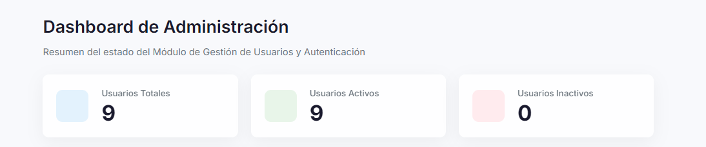
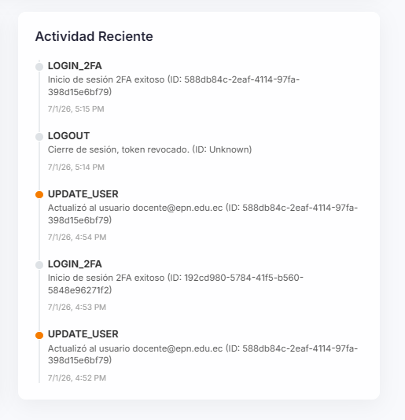
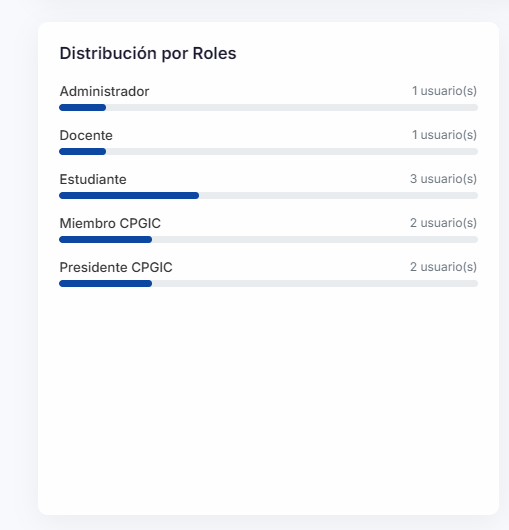

# Pruebas Funcionales del Sprint 4

**Introducción:** Aseguramiento de calidad para Dashboard de Métricas, KPIs, Gráficos y Optimización de Caché.

En esta sección se presenta la matriz de los casos de prueba ejecutados durante este Sprint. El dashboard directivo (`GET /api/dashboard/stats`, restringido a Administrador) expone 4 indicadores reales, en el mismo orden en que aparecen en pantalla: Usuarios Totales/Activos/Inactivos, Actividad de los Últimos 7 Días, Distribución por Roles y Actividad Reciente. Cada caso valida uno de estos indicadores de forma independiente, contrastando el dato devuelto por la API contra el estado real de la base de datos. La correspondencia con el código (`DashboardController.cs`, `dashboard-home.component.html`) se verifica automáticamente en `Sprint4_DashboardTests.cs`.

<table style="width: 100%; border-collapse: collapse; font-family: Arial, sans-serif; border: 2px solid black; font-size: 14px;">
    <tr style="background-color: #000000; color: #ffffff;">
        <th colspan="7" style="padding: 10px; border: 1px solid black;">Matriz de Pruebas: Pruebas Funcionales del Sprint 4</th>
    </tr>
    <tr style="background-color: #333333; color: #ffffff; text-align: center;">
        <th style="padding: 8px; border: 1px solid black;">ID</th>
        <th style="padding: 8px; border: 1px solid black;">HU</th>
        <th style="padding: 8px; border: 1px solid black;">Descripción del caso</th>
        <th style="padding: 8px; border: 1px solid black;">Datos de entrada</th>
        <th style="padding: 8px; border: 1px solid black;">Resultado esperado</th>
        <th style="padding: 8px; border: 1px solid black;">Resultado real</th>
        <th style="padding: 8px; border: 1px solid black;">Estado</th>
    </tr>
    <tr style="background-color: #ffffff; text-align: center; color: black;">
        <td style="padding: 8px; border: 1px solid black; font-weight: bold;">CP4-01</td>
        <td style="padding: 8px; border: 1px solid black;">HU-08</td>
        <td style="padding: 8px; border: 1px solid black; text-align: left;">Indicador: Usuarios Totales / Activos / Inactivos</td>
        <td style="padding: 8px; border: 1px solid black;">GET /api/dashboard/stats</td>
        <td style="padding: 8px; border: 1px solid black;">totalUsers, activeUsers e inactiveUsers coinciden con el estado real de la base (p. ej. 9 / 9 / 0)</td>
        <td style="padding: 8px; border: 1px solid black;">Aprobado</td>
        <td style="padding: 8px; border: 1px solid black; font-weight: bold; background-color: #d9ecd9;">Aprobado</td>
    </tr>
    <tr style="background-color: #f2f2f2; text-align: center; color: black;">
        <td style="padding: 8px; border: 1px solid black; font-weight: bold;">CP4-02</td>
        <td style="padding: 8px; border: 1px solid black;">HU-08</td>
        <td style="padding: 8px; border: 1px solid black; text-align: left;">Indicador: Actividad de los Últimos 7 Días</td>
        <td style="padding: 8px; border: 1px solid black;">GET /api/dashboard/stats</td>
        <td style="padding: 8px; border: 1px solid black;">activityByDay devuelve 7 puntos (uno por día) con el conteo real de eventos de auditoría</td>
        <td style="padding: 8px; border: 1px solid black;">Aprobado</td>
        <td style="padding: 8px; border: 1px solid black; font-weight: bold; background-color: #d9ecd9;">Aprobado</td>
    </tr>
    <tr style="background-color: #ffffff; text-align: center; color: black;">
        <td style="padding: 8px; border: 1px solid black; font-weight: bold;">CP4-03</td>
        <td style="padding: 8px; border: 1px solid black;">HU-08</td>
        <td style="padding: 8px; border: 1px solid black; text-align: left;">Indicador: Distribución por Roles</td>
        <td style="padding: 8px; border: 1px solid black;">GET /api/dashboard/stats</td>
        <td style="padding: 8px; border: 1px solid black;">rolesDistribution refleja el conteo real de usuarios por cada rol del sistema</td>
        <td style="padding: 8px; border: 1px solid black;">Aprobado</td>
        <td style="padding: 8px; border: 1px solid black; font-weight: bold; background-color: #d9ecd9;">Aprobado</td>
    </tr>
    <tr style="background-color: #f2f2f2; text-align: center; color: black;">
        <td style="padding: 8px; border: 1px solid black; font-weight: bold;">CP4-04</td>
        <td style="padding: 8px; border: 1px solid black;">HU-08</td>
        <td style="padding: 8px; border: 1px solid black; text-align: left;">Indicador: Actividad Reciente</td>
        <td style="padding: 8px; border: 1px solid black;">GET /api/dashboard/stats</td>
        <td style="padding: 8px; border: 1px solid black;">recentActivity devuelve los 5 eventos de auditoría más recientes, en orden descendente</td>
        <td style="padding: 8px; border: 1px solid black;">Aprobado</td>
        <td style="padding: 8px; border: 1px solid black; font-weight: bold; background-color: #d9ecd9;">Aprobado</td>
    </tr>
</table>

---

## Desglose Analítico por Caso de Prueba

### CP4-01: Indicador — Usuarios Totales / Activos / Inactivos

**Historia de Usuario Relacionada:** HU-08

**Explicación Técnica del Caso:**
`DashboardController.GetDashboardStats()` calcula `totalUsers` con `_userManager.Users.CountAsync()`, `activeUsers` con `_userManager.Users.CountAsync(u => u.IsActive)`, e `inactiveUsers` como `totalUsers - activeUsers` (sin una segunda consulta). El frontend los muestra como las tres primeras tarjetas de `dashboard-home.component.html`.

**Análisis de Seguridad y Desarrollo:**

> Los tres valores reflejan el estado real de la base en el momento de la consulta, sin caché intermedio que pueda desincronizarlos; dan visibilidad inmediata de cuántas cuentas institucionales tienen acceso vigente.

**Evidencia Visual:**

    
[Espacio reservado para imagen: Evidencia de la ejecución del CP4-01]

    

---

### CP4-02: Indicador — Actividad de los Últimos 7 Días

**Historia de Usuario Relacionada:** HU-08

**Explicación Técnica del Caso:**
`GetDashboardStats()` toma los eventos de `LogAuditoria` de los últimos 7 días y los agrupa por fecha (`Enumerable.Range(0, 7)` sobre el día calendario), devolviendo `activityByDay` como una serie de 7 puntos `{ date, count }`. El frontend renderiza esta serie con `ActivityChartComponent` (`<app-activity-chart>`), un gráfico de barras SVG propio.

**Análisis de Seguridad y Desarrollo:**

> Permite al Administrador identificar de un vistazo picos o caídas de actividad en la última semana, sin depender de una librería externa de gráficos.

**Evidencia Visual:**

    
[Espacio reservado para imagen: Evidencia de la ejecución del CP4-02]

    

---

### CP4-03: Indicador — Distribución por Roles

**Historia de Usuario Relacionada:** HU-08

**Explicación Técnica del Caso:**
`GetDashboardStats()` agrupa `_context.UserRoles` con `GroupBy(ur => ur.RoleId)` en una sola consulta, y cruza el resultado contra la lista de roles del sistema para armar `rolesDistribution` (diccionario rol → cantidad de usuarios). El frontend lo muestra como una lista de barras de progreso en la tarjeta "Distribución por Roles".

**Análisis de Seguridad y Desarrollo:**

> El conteo se resuelve con una sola consulta agrupada en vez de una consulta por cada rol, evitando el patrón N+1 que antes generaba latencia adicional contra la base de datos.

**Evidencia Visual:**

    
[Espacio reservado para imagen: Evidencia de la ejecución del CP4-03]

    

---

### CP4-04: Indicador — Actividad Reciente

**Historia de Usuario Relacionada:** HU-08

**Explicación Técnica del Caso:**
`GetDashboardStats()` toma `_context.LogAuditoria.OrderByDescending(l => l.Timestamp).Take(5)`, proyectando `actionType`, `timestamp`, `details` y `userId`. El frontend lo muestra como una línea de tiempo en la tarjeta "Actividad Reciente", con un ícono distinto según el tipo de evento.

**Análisis de Seguridad y Desarrollo:**

> Le da al Administrador un resumen inmediato de los últimos eventos críticos del sistema sin tener que entrar al módulo completo de auditoría (Sprint 3).

**Evidencia Visual:**

    
[Espacio reservado para imagen: Evidencia de la ejecución del CP4-04]

    

---
